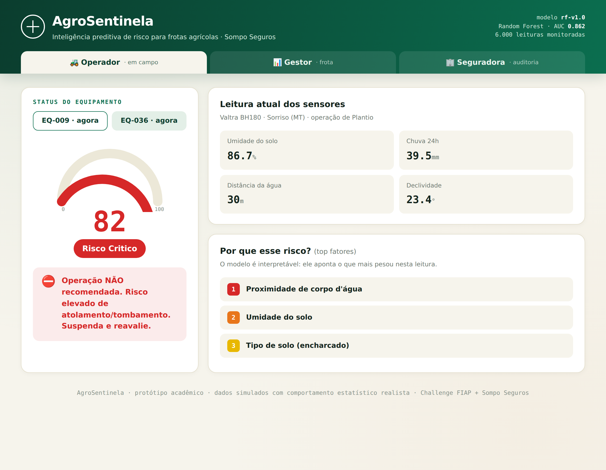
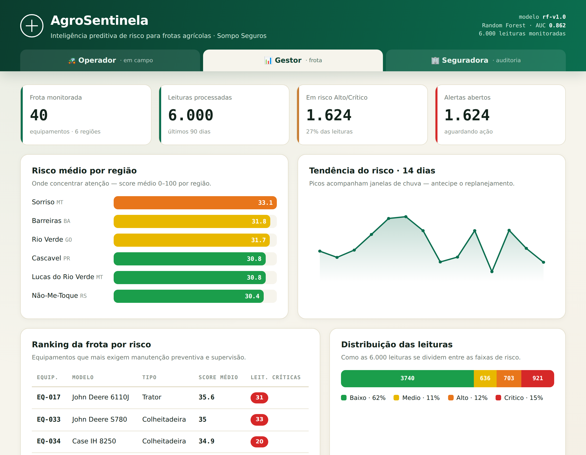
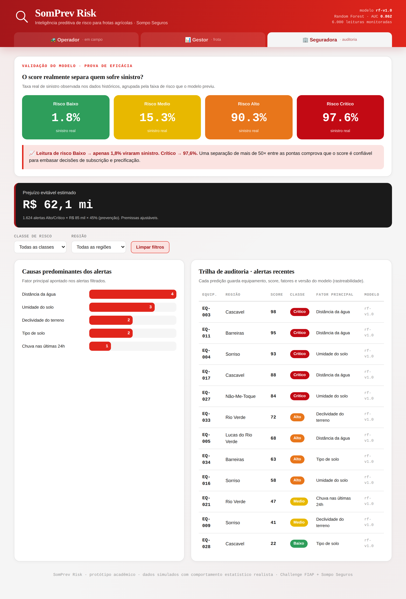
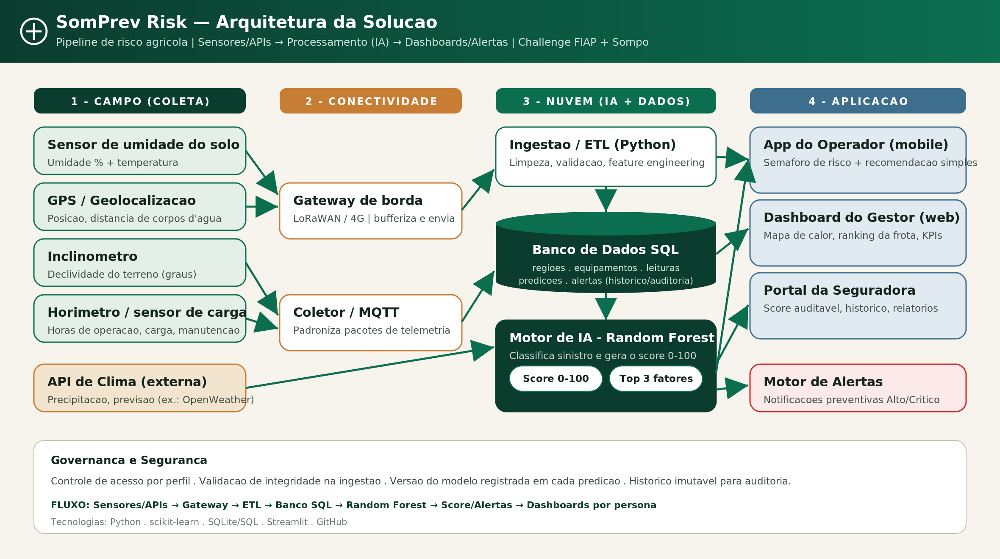

<p align="center">
  <a href="https://www.fiap.com.br/">
    
  </a>
</p>

# SomPrev Risk — Sistema Preditivo de Risco Agrícola

## Challenge FIAP + Sompo Seguros

Inteligência preditiva que transforma a gestão de risco de frotas agrícolas de uma atuação **reativa** para **preventiva**: calcula um **score de risco de 0 a 100** por equipamento/região, classifica em quatro faixas (Baixo, Médio, Alto, Crítico) e gera **alertas e recomendações acionáveis** antes do incidente.

## 👨‍🎓 Integrantes

- Karina Garta Szewczuk — RM569309
- Maria Sabrina Feitosa da Silva — RM568714
- Nicolas Lima Apolinário — RM570741
- Roger Gabriel de Souza Jesus Costa — RM573659

## 👩‍🏫 Professores

### Tutora

- Sabrina Otoni

### Coordenador

- André Godói

## 🎥 Vídeo demonstrativo

Link (não listado): https://youtu.be/q7YVjxpytPo

## 📜 Descrição

O **SomPrev Risk** é uma solução de inteligência preditiva desenvolvida no Challenge FIAP + Sompo Seguros para transformar a gestão de risco de frotas agrícolas de um modelo **reativo** para um modelo **preventivo**. A proposta calcula, para cada equipamento e região, um **score de risco operacional de 0 a 100**, classifica esse risco em quatro faixas (Baixo, Médio, Alto e Crítico) e gera **alertas e recomendações acionáveis** antes que o incidente aconteça.

**O problema.** O agronegócio brasileiro opera em ambientes dinâmicos, nos quais umidade do solo, chuva, declividade e proximidade de corpos d'água elevam o risco de atolamentos, tombamentos e danos mecânicos. O contexto justifica a urgência: o seguro rural cobriu cerca de **6,3 milhões de hectares** e **~R$ 45 bilhões** em valor segurado em 2024 (Mapa/Agência Gov), enquanto as **indenizações somaram cerca de R$ 60,3 bilhões no mesmo ano** (CNseg, via Poder360, 2025) e estima-se que **~85% da área plantada esteja sem seguro** (CNseg, via Exame, 2023). No campo, o Brasil é líder mundial em fatalidades com tratores — cerca de **3 mil mortes por ano** (Canal Rural) — e um estudo no Rio Grande do Sul aponta que **96,8% desses acidentes seriam evitáveis por prevenção** (Tecno-Lógica, 2021), exatamente a lacuna que a solução ataca. Fontes completas em `document/contextualizacao.md`.

**A solução.** A partir de dados de sensores e telemetria (umidade do solo, precipitação, declividade, distância de corpos d'água, tipo de solo, idade e manutenção do equipamento, entre outros), um modelo de **Machine Learning supervisionado** estima a probabilidade de sinistro e a converte no score de risco. Cada predição informa os **três principais fatores** que elevaram o risco, apoiando a decisão.

**Inteligência preditiva.** Foram comparados três algoritmos (Logistic Regression, Random Forest e Gradient Boosting). O escolhido foi o **Random Forest**, pela melhor acurácia, robustez e interpretabilidade. Sobre uma base de 6.000 leituras (split 75/25 e validação cruzada de 5 folds), o modelo atingiu **acurácia de 84,1% e ROC-AUC de 0,862**. A validação mais relevante mostra que o score separa o risco na prática: leituras classificadas como Baixo viraram sinistro em apenas **1,8%** dos casos, contra **97,6%** nas classificadas como Crítico.

**Arquitetura e dados.** O pipeline integra coleta (sensores e API de clima) → ingestão/ETL em Python → **banco de dados SQL relacional** (histórico auditável e versionamento do modelo) → motor de IA → **dashboards por persona**: o Operador vê um semáforo simples com recomendação direta; o Gestor acompanha mapa de calor por região, ranking da frota e tendências; o Analista da Seguradora dispõe de validação estatística e trilha de auditoria rastreável.

> Os dados operacionais são **simulados** (uso permitido pelo enunciado), porém calibrados para refletir o comportamento descrito pelas fontes citadas. Fontes completas em `document/contextualizacao.md`.

## 🖥️ Painéis por persona (dashboard)

O protótipo estático (`src/dashboards/preview_dashboard.html`) e o app funcional (`src/dashboards/app.py`, em Streamlit, lendo o banco ao vivo) trazem três visões sob medida:

**🚜 Operador — somente leitura.** Mostra o risco de operar agora com semáforo (score de 0 a 100), recomendação e os três principais fatores. Os valores chegam **automaticamente dos sensores e da API de clima** — o operador não digita nem ajusta nada. Uma camada de ajuda ("Como ler este painel") e **tooltips** em cada variável explicam o significado e a origem do dado (sensor de umidade, previsão do tempo, GPS, inclinômetro).

**📊 Gestor — frota, filtros e simulador.** KPIs, risco médio por região, ranking da frota e distribuição por faixa, com **filtros por região e por tipo de equipamento** (Trator, Colheitadeira, Pulverizador). Inclui um **simulador de cenário "e se?"** (sliders de umidade, chuva, distância da água e declividade) que recalcula o risco em tempo real — uma **aproximação didática** do Random Forest treinado, voltada ao planejamento (ex.: "e se chover forte amanhã?") e não à decisão final.

**🏢 Seguradora — validação e auditoria.** Prova de eficácia (taxa real de sinistro por faixa), trilha de auditoria e causas predominantes, com **filtros por classe de risco e por região**. No app Streamlit, todos os filtros operam sobre os **6.000 registros do banco ao vivo**.

**💰 Prejuízo evitável estimado.** Os painéis do Gestor e da Seguradora exibem um indicador em R$ calculado como `nº de alertas Alto/Crítico × custo médio do sinistro × taxa de prevenção`. É uma **estimativa** com **premissas ajustáveis** (`CUSTO_MEDIO_SINISTRO` e `TAXA_PREVENCAO` em `src/scripts/risco_utils.py`) e recalcula conforme os filtros.

> Identidade visual alinhada à marca **Sompo** (vermelho institucional), tipografia Roboto Slab / Roboto / Roboto Mono, e o rótulo do fator padronizado como **"Distância da água"**.

### Capturas das telas







## 📁 Estrutura de pastas

- **.github**: arquivos de configuração do GitHub.
- **assets**: imagens e elementos não estruturados (ex.: logo da FIAP).
- **config**: arquivos de configuração do projeto, incluindo `requirements.txt`.
- **document**: documentação do projeto — personas, dicionário de variáveis, contextualização com fontes, documentação da inteligência preditiva, relatório de validação, diagrama de arquitetura e a subpasta `prints/` com capturas de tela. Documentos complementares em `document/other`.
- **scripts**: scripts auxiliares de tarefa (deploy, manutenção, etc.).
- **src**: todo o código-fonte — `src/datasets` (geração de dados), `src/scripts` (treino, banco e geração do diagrama), `src/models` (modelo treinado e métricas), `src/database` (schema, queries e banco SQLite) e `src/dashboards` (app Streamlit e protótipo HTML).
- **README.md**: este guia geral do projeto.

## 🔧 Como executar o código

**Pré-requisitos:** Python 3.10+ e pip. Recomendado criar um ambiente virtual.

```bash
# 1) Dependências
pip install -r config/requirements.txt

# 2) Gerar a base de dados (6.000 leituras, seed fixa = reprodutível)
python src/datasets/gerar_dataset.py

# 3) Treinar e validar o modelo (gera métricas e gráficos)
python src/scripts/treinar_modelo.py

# 4) Criar e popular o banco SQL (roda o modelo, gera predições e alertas)
python src/scripts/popular_banco.py

# 5) (opcional) Regerar o diagrama de arquitetura
python src/scripts/_gerar_arquitetura.py

# 6a) Dashboard estático: abra no navegador
#     src/dashboards/preview_dashboard.html
# 6b) Dashboard funcional (lê o banco ao vivo):
streamlit run src/dashboards/app.py
```

### Arquitetura da solução



### Resultados reais (Random Forest)

| Métrica | Valor |
|---|---|
| Acurácia | 0,841 |
| Precisão | 0,772 |
| Recall | 0,621 |
| F1 | 0,688 |
| ROC-AUC | 0,862 |

Taxa real de sinistro por faixa prevista: 🟢 Baixo **1,8%** · 🟡 Médio **15,3%** · 🟠 Alto **90,3%** · 🔴 Crítico **97,6%**. Relatório completo em `document/relatorio_validacao.md`.

## 🗃 Histórico de lançamentos

- 0.4.0 — Dashboard interativo: Operador somente leitura com ajuda e tooltips, simulador de cenário no Gestor, filtros (Gestor e Seguradora), indicador de prejuízo evitável e identidade visual Sompo
- 0.3.0 — Implementação funcional ponta a ponta (IA + SQL + dashboards) e adequação ao template FIAP
- 0.2.0 — Integração da Sprint 2
- 0.1.0 — Estrutura inicial do projeto

## 📋 Licença

 

[MODELO GIT FIAP](https://github.com/agodoi/template) por [FIAP](https://fiap.com.br) está licenciado sobre [Attribution 4.0 International](http://creativecommons.org/licenses/by/4.0/?ref=chooser-v1).
