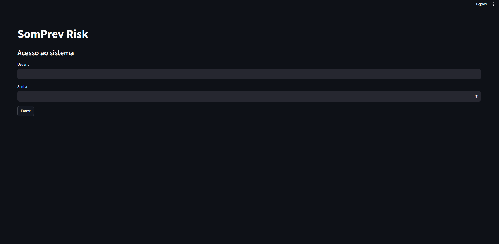
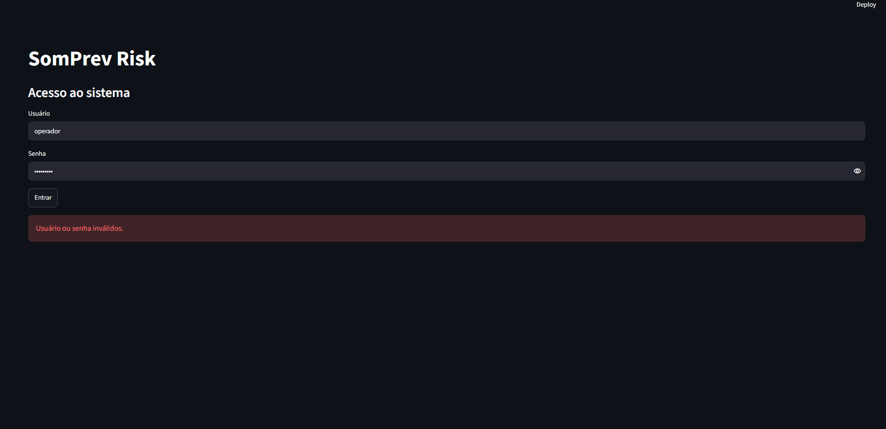
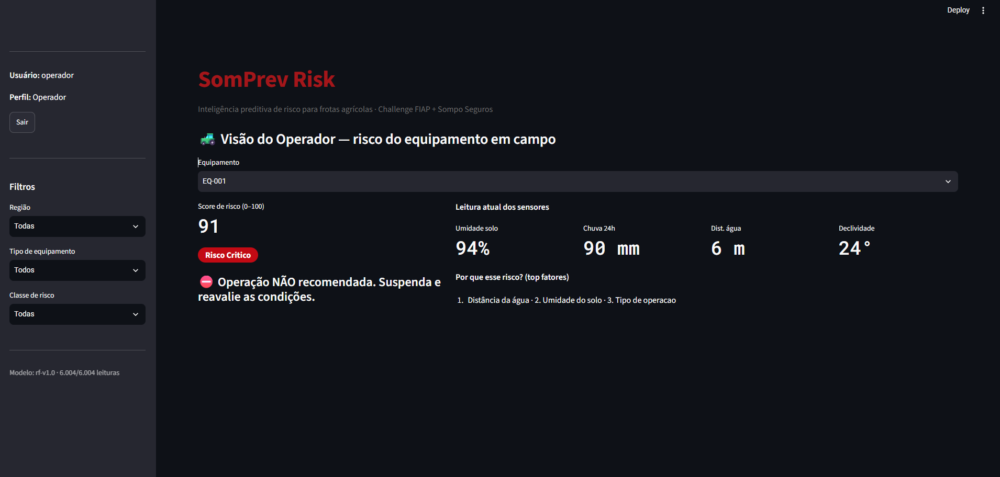
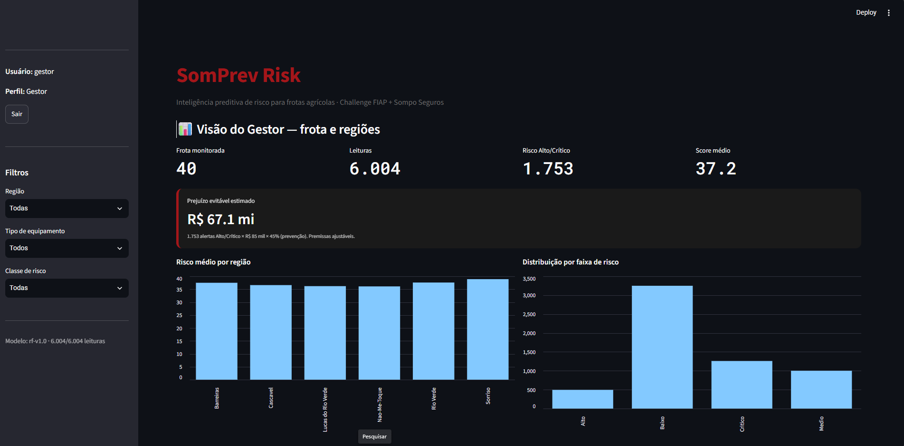
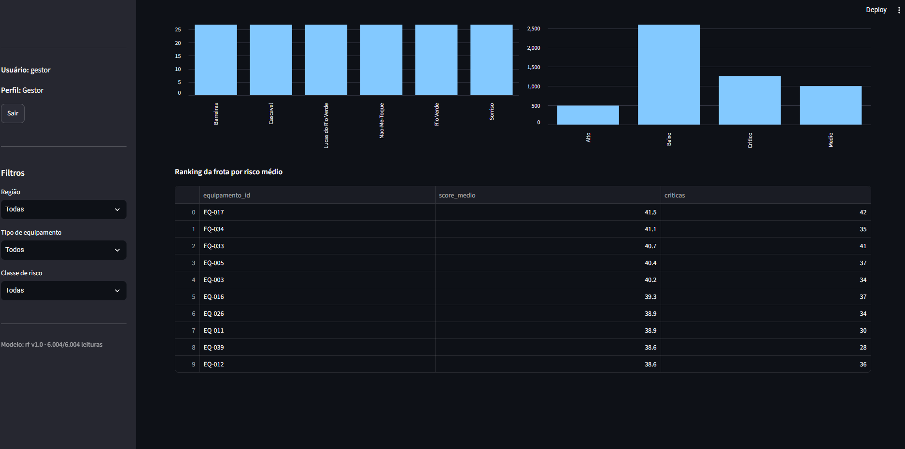
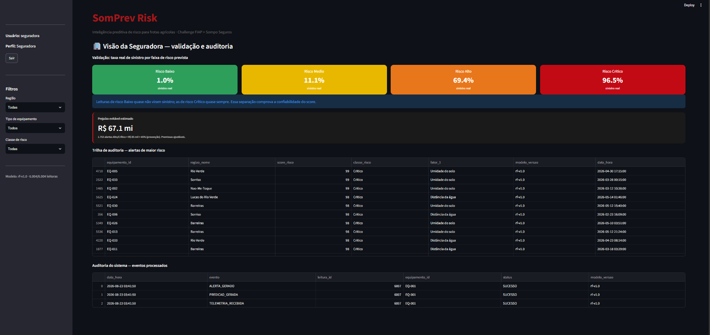
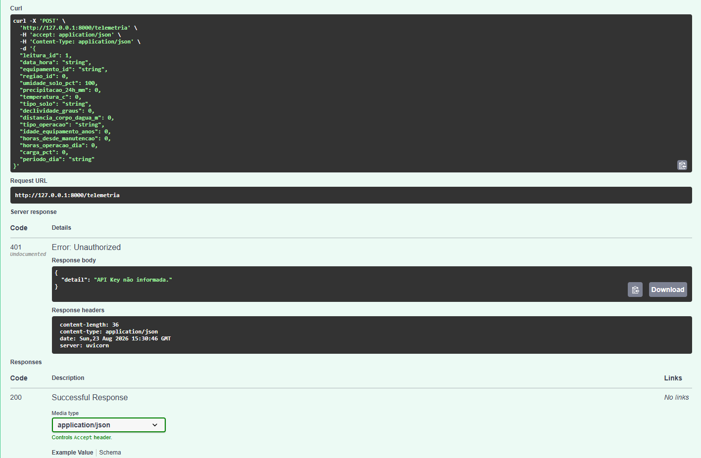
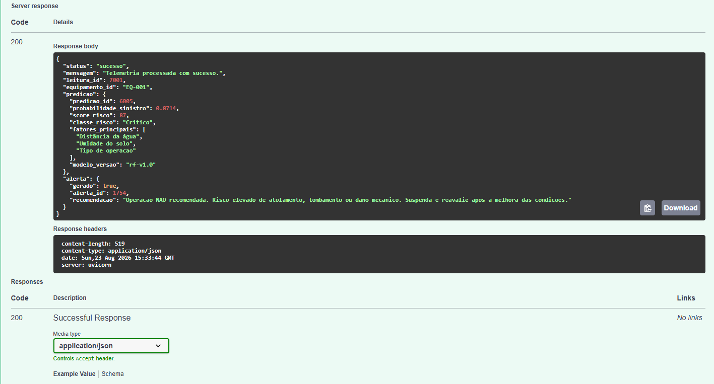
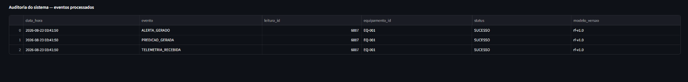

<p align="center">
  <a href="https://www.fiap.com.br/">
    
  </a>
</p>

# SomPrev Risk — Sistema Preditivo de Risco Agrícola

## Challenge FIAP + Sompo Seguros

O **SomPrev Risk** é uma solução de inteligência preditiva para apoiar a prevenção de riscos em frotas agrícolas. O sistema calcula um **score de risco de 0 a 100**, classifica a operação em quatro faixas — **Baixo, Médio, Alto e Crítico** — e apresenta fatores de risco, alertas e recomendações para apoiar a tomada de decisão.

Na **Sprint 2**, o projeto já possuía uma base histórica simulada, modelo preditivo treinado, banco SQLite e dashboards por persona.

Na **Sprint 3**, o foco foi transformar esses componentes em um **MVP integrado**, conectando entrada de dados, backend, validação, persistência incremental, modelo preditivo, alertas, dashboard, segurança e auditoria.

A Sprint 3 representa a evolução do projeto para aproximadamente **60% do MVP**, conforme o escopo do briefing.

---

## 👨‍🎓 Integrantes

- Karina Garta Szewczuk — RM569309
- Maria Sabrina Feitosa da Silva — RM568714
- Nicolas Lima Apolinário — RM570741
- Roger Gabriel de Souza Jesus Costa — RM573659

## 👩‍🏫 Professores

### Tutora
- Sabrina Otoni

### Coordenador
- André Godói

---

## 🎥 Vídeo demonstrativo — Sprint 3

<a href="https://youtu.be/Aqp8JTDbSMo" target="_blank"> Clique para assistir</a>

---

# 📈 Evolução do projeto

## O que já existia na Sprint 2

Na Sprint 2, o SomPrev Risk já possuía os principais componentes de inteligência preditiva:

- base simulada com **6.000 leituras**;
- preparação dos dados;
- comparação entre algoritmos de Machine Learning;
- escolha do **Random Forest**;
- modelo treinado salvo em `modelo_risco.pkl`;
- métricas de desempenho;
- score de risco de 0 a 100;
- classificação em Baixo, Médio, Alto e Crítico;
- identificação dos três principais fatores de risco;
- banco de dados SQLite;
- predições e alertas gerados em carga histórica;
- dashboards em Streamlit para Operador, Gestor e Seguradora.

Nesse estágio, o projeto funcionava principalmente sobre uma **base já gerada e processada previamente**.

## O que evoluiu na Sprint 3

Na Sprint 3, o principal avanço foi a **integração dos componentes existentes em um fluxo operacional**.

| Componente | Antes — Sprint 2 | Evolução — Sprint 3 |
|---|---|---|
| Entrada de dados | Base histórica gerada por script | Nova telemetria recebida por API |
| Backend | Sem camada de API integrada | Backend FastAPI |
| Processamento | Predições geradas em carga | Predição executada a cada nova telemetria |
| Persistência | Banco populado em lote | Inclusão incremental sem apagar histórico |
| Modelo | Random Forest treinado | Modelo integrado ao `POST /telemetria` |
| Validação | Focada na preparação dos dados | Validação de payload, equipamento, região e duplicidade |
| Segurança da API | Não havia API protegida | API Key via `X-API-Key` |
| Controle de acesso | Seleção de persona no dashboard | Login por usuário e senha com perfil fixo |
| Alertas | Gerados durante a carga histórica | Gerados automaticamente em novas leituras Alto/Crítico |
| Auditoria | Sem tabela dedicada | Registro de eventos em tabela `auditoria` |
| Rastreabilidade | Baseada em predições armazenadas | Eventos `TELEMETRIA_RECEBIDA`, `PREDICAO_GERADA` e `ALERTA_GERADO` |
| Dashboard Seguradora | Histórico e validação | Auditoria real integrada ao painel |
| Configuração sensível | Não centralizada | `.env` + `.env.example` |
| Arquitetura | Pipeline conceitual | Fluxo integrado documentado em PNG e SVG |

### Resultado da evolução

O projeto passou de um fluxo predominantemente **offline/batch** para um MVP capaz de:

```text
receber uma nova leitura
        ↓
validar os dados
        ↓
persistir a telemetria
        ↓
executar o Random Forest
        ↓
calcular o score
        ↓
classificar o risco
        ↓
gerar alerta quando necessário
        ↓
registrar auditoria
        ↓
exibir o resultado no dashboard
```

---

## 📜 Descrição da solução

O **SomPrev Risk** foi desenvolvido para apoiar uma atuação preventiva na gestão de risco de frotas agrícolas.

A solução utiliza dados operacionais e ambientais simulados, como:

- umidade do solo;
- precipitação nas últimas 24 horas;
- temperatura;
- tipo de solo;
- declividade;
- distância de corpos d'água;
- tipo de operação;
- idade do equipamento;
- horas desde a última manutenção;
- horas de operação;
- carga;
- período do dia.

A partir dessas variáveis, o modelo estima a probabilidade de sinistro. Essa probabilidade é convertida em um **score de 0 a 100** e classificada em:

- **Baixo**
- **Médio**
- **Alto**
- **Crítico**

Cada predição também apresenta os **três principais fatores de risco** associados à leitura.

> Os dados utilizados no projeto são simulados, conforme permitido pelo enunciado do Challenge.

---

## 🧠 Inteligência preditiva

Na etapa de modelagem foram comparados:

- Logistic Regression;
- Random Forest;
- Gradient Boosting.

O modelo escolhido foi o **Random Forest**.

### Resultados do modelo

| Métrica | Valor |
|---|---:|
| Acurácia | 0,841 |
| Precisão | 0,772 |
| Recall | 0,621 |
| F1 | 0,688 |
| ROC-AUC | 0,862 |

Taxa real de sinistro por faixa prevista:

- 🟢 Baixo: **1,8%**
- 🟡 Médio: **15,3%**
- 🟠 Alto: **90,3%**
- 🔴 Crítico: **97,6%**

Relatório completo:

```text
document/relatorio_validacao.md
```

---

# 🔄 Sprint 3 — Integração do MVP

## Fluxo integrado implementado

```text
Telemetria simulada / JSON
          ↓
FastAPI
POST /telemetria
          ↓
API Key + Pydantic + validações
          ↓
SQLite
          ↓
Random Forest
          ↓
Probabilidade de sinistro
          ↓
Score 0–100
          ↓
Classe de risco + Top 3 fatores
          ↓
Predição + alerta Alto/Crítico
          ↓
Dashboard Streamlit
          ↓
Operador | Gestor | Seguradora

          +
Trilha de auditoria
```

---

## ⚙️ Backend e API

O backend integrador foi implementado com **FastAPI**.

Arquivo principal:

```text
src/backend/app.py
```

### Endpoints implementados

- `GET /`
- `GET /health`
- `POST /telemetria`

### `POST /telemetria`

Ao receber uma nova leitura, o backend:

1. valida a estrutura do payload;
2. verifica o equipamento informado;
3. verifica a região informada;
4. impede `leitura_id` duplicado;
5. prepara as variáveis do modelo;
6. executa o Random Forest;
7. calcula a probabilidade de sinistro;
8. converte a probabilidade em score de 0 a 100;
9. classifica o risco;
10. identifica os três principais fatores;
11. salva a leitura;
12. salva a predição;
13. gera alerta para risco Alto ou Crítico;
14. registra os eventos de auditoria.

A documentação interativa está disponível em:

```text
http://127.0.0.1:8000/docs
```

---

## 🗄️ Persistência incremental

O banco utilizado é:

```text
src/database/somprev_risk.db
```

Na Sprint 2, a base era criada e populada principalmente pelo script:

```text
src/scripts/popular_banco.py
```

Na Sprint 3, o banco passou a receber **novas leituras incrementalmente pela API**, preservando o histórico existente.

As principais tabelas são:

- `regioes`;
- `equipamentos`;
- `leituras`;
- `predicoes`;
- `alertas`;
- `auditoria`.

O schema está em:

```text
src/database/schema.sql
```

Após os testes da integração, foi feita uma verificação de consistência entre leituras e predições, sem registros órfãos remanescentes.

---

## ✅ Validação

A Sprint 3 adicionou validações para a entrada de novas leituras.

Entre elas:

- `leitura_id` obrigatório e positivo;
- umidade entre 0 e 100%;
- valores não negativos onde aplicável;
- equipamento existente;
- região existente;
- bloqueio de leitura duplicada.

---

## 🔐 Segurança

### Proteção da API

O endpoint `POST /telemetria` exige uma API Key no header:

```text
X-API-Key
```

Comportamento validado:

- sem API Key → `401 Unauthorized`;
- API Key inválida → `401 Unauthorized`;
- API Key válida → requisição processada.

### Autenticação do dashboard

O Streamlit possui login por usuário e senha para três perfis:

- Operador;
- Gestor;
- Seguradora.

Após o login, cada usuário acessa a visão correspondente ao seu perfil.

Também foi validado o bloqueio de credenciais incorretas.

### Variáveis de ambiente

Credenciais e API Key são carregadas por:

```text
.env
```

O arquivo não deve ser versionado.

O projeto inclui:

```text
.env.example
```

com a estrutura das variáveis necessárias e sem dados sensíveis.

---

## 🧾 Auditoria e rastreabilidade

A Sprint 3 adicionou uma tabela específica de auditoria.

Eventos registrados:

```text
TELEMETRIA_RECEBIDA
PREDICAO_GERADA
ALERTA_GERADO
```

Cada evento pode armazenar:

- data e hora;
- evento;
- `leitura_id`;
- `equipamento_id`;
- status;
- detalhes;
- versão do modelo.

Fluxo auditável:

```text
TELEMETRIA_RECEBIDA
        ↓
PREDICAO_GERADA
        ↓
ALERTA_GERADO
```

A auditoria também foi integrada ao painel da **Seguradora**.

---

## 🖥️ Dashboard por persona

Arquivo:

```text
src/dashboards/app.py
```

### 🚜 Operador

Apresenta:

- equipamento;
- score de risco;
- classe;
- recomendação;
- umidade;
- precipitação;
- distância da água;
- declividade;
- três principais fatores.

### 📊 Gestor

Apresenta:

- frota monitorada;
- total de leituras;
- registros Alto/Crítico;
- score médio;
- prejuízo evitável estimado;
- risco médio por região;
- distribuição das classes;
- ranking da frota;
- filtros.

### 🏢 Seguradora

Apresenta:

- taxa real de sinistro por faixa;
- prejuízo evitável estimado;
- histórico das operações de maior risco;
- versão do modelo;
- eventos reais de auditoria.

---

## 💰 Prejuízo evitável estimado

As visões do Gestor e da Seguradora apresentam um indicador estimado:

```text
nº de alertas Alto/Crítico
× custo médio do sinistro
× taxa de prevenção
```

As premissas estão em:

```text
src/scripts/risco_utils.py
```

O indicador é apresentado como **estimativa**, e não como economia financeira comprovada.

---

## 🏗️ Arquitetura da Sprint 3

A arquitetura foi atualizada para representar o fluxo efetivamente implementado na Sprint 3.

Arquivos:

- `document/arquitetura.png`
- `document/arquitetura.svg`


---

## 📁 Estrutura principal

```text
sompo_Challenge-
│
├── config/
│   └── requirements.txt
│
├── document/
│   ├── arquitetura.png
│   ├── arquitetura.svg
│   ├── contextualizacao.md
│   ├── relatorio_validacao.md
│   └── prints/
│
├── src/
│   ├── backend/
│   │   └── app.py
│   ├── dashboards/
│   │   └── app.py
│   ├── database/
│   │   ├── schema.sql
│   │   └── somprev_risk.db
│   ├── datasets/
│   ├── models/
│   └── scripts/
│
├── .env.example
├── .gitignore
└── README.md
```

---

# 🔧 Como executar

## 1. Instalar dependências

```powershell
.\venv\Scripts\python.exe -m pip install -r config\requirements.txt
```

## 2. Configurar o `.env`

Crie o arquivo `.env` na raiz usando `.env.example` como referência.

## 3. Iniciar a API

```powershell
.\venv\Scripts\python.exe -m uvicorn app:app --app-dir src\backend --reload
```

Swagger:

```text
http://127.0.0.1:8000/docs
```

## 4. Iniciar o dashboard

Em outro terminal:

```powershell
.\venv\Scripts\python.exe -m streamlit run src/dashboards/app.py
```

Dashboard:

```text
http://localhost:8501
```

> O script `popular_banco.py` recria a base histórica. No fluxo normal da Sprint 3, novas leituras devem entrar pela API.

---

# 🧪 Evidências da evolução na Sprint 3

As evidências abaixo demonstram as funcionalidades adicionadas e integradas nesta Sprint.

## 1. Autenticação adicionada ao dashboard

Tela de login:



Bloqueio de credenciais inválidas:



## 2. Dashboard por perfil

### Operador



### Gestor





### Seguradora



## 3. Segurança da API

A API foi testada sem autenticação, retornando `401 Unauthorized`:



## 4. Integração ponta a ponta

Uma nova telemetria foi enviada com API Key válida, processada pelo Random Forest e retornada com score, classe, fatores e alerta:



## 5. Auditoria

A solução registra os eventos do processamento:



### Funcionalidades comprovadas

- entrada incremental por API;
- validação da telemetria;
- proteção por API Key;
- execução do Random Forest;
- score e classificação;
- geração de alerta;
- persistência;
- login por perfil;
- auditoria;
- integração da auditoria ao dashboard da Seguradora.

---

## 🗃 Histórico de evolução

- **0.5.0 — Sprint 3:** backend FastAPI, `POST /telemetria`, persistência incremental, API Key, login por perfil, validações, auditoria e integração ponta a ponta.
- **0.4.0:** evolução dos dashboards e indicadores.
- **0.3.0:** implementação funcional de IA, banco SQL e dashboards.
- **0.2.0 — Sprint 2:** desenvolvimento e validação do modelo preditivo.
- **0.1.0:** estrutura inicial do projeto.

---

## 📋 Licença

 

[MODELO GIT FIAP](https://github.com/agodoi/template) por [FIAP](https://fiap.com.br) está licenciado sob [Attribution 4.0 International](http://creativecommons.org/licenses/by/4.0/?ref=chooser-v1).


