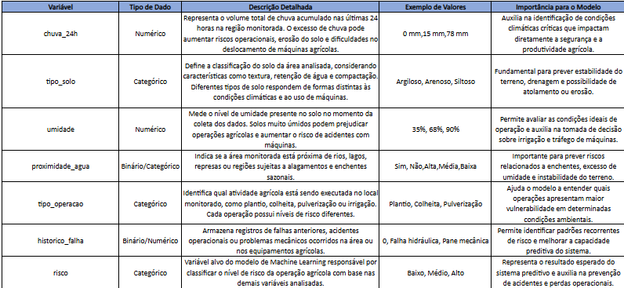
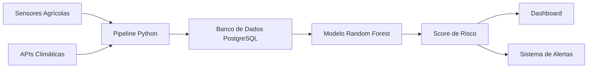

# 🎓 FIAP - Faculdade de Informática e Administração Paulista

# 🚜 Challenge Sompo Seguros

# 🌱 Sistema Preditivo de Risco Agrícola

<p align="center">
  <a href="https://www.fiap.com.br/">
    
  </a>
</p>


</p>

---

# 👨‍🎓 Integrantes

| Integrante                         | RM       |
| ---------------------------------- | -------- |
| Karina Garta Szewczuk              | RM569309 |
| Maria Sabrina Feitosa da Silva     | RM568714 |
| Nicolas Lima Apolinário            | RM570741 |
| Roger Gabriel de Souza Jesus Costa | RM573659 |

---

# 👩‍🏫 Professores

## Tutora

* Sabrina Otoni

## Coordenador

* André Godói

---

# 📜 Introdução

O presente projeto propõe o desenvolvimento de uma solução inteligente para prevenção de riscos operacionais no setor agrícola, utilizando técnicas de Inteligência Artificial, análise estatística e integração de dados.
A proposta foi desenvolvida em parceria acadêmica com a Sompo Seguros, tendo como objetivo transformar a gestão de riscos agrícolas por meio da análise preditiva de variáveis ambientais e operacionais.
A solução busca migrar o modelo tradicional de atuação reativa para uma abordagem preventiva, permitindo identificar situações críticas antes que incidentes ocorram.
O sistema utiliza dados provenientes de sensores, APIs climáticas e registros operacionais para calcular scores de risco em tempo real, auxiliando operadores, gestores e seguradoras na tomada de decisão.

---

# 🌎 Contextualização do Problema

O agronegócio brasileiro apresenta alta dependência de variáveis climáticas e condições ambientais, o que torna suas operações suscetíveis a riscos operacionais relevantes.

Segundo a Embrapa, fatores como alta umidade do solo, precipitação intensa e características inadequadas do terreno aumentam significativamente a probabilidade de falhas operacionais, incluindo compactação do solo, atolamentos e danos a equipamentos agrícolas.

De forma complementar, a Confederação da Agricultura e Pecuária do Brasil (CNA) aponta que eventos climáticos extremos vêm causando impactos econômicos expressivos no setor, afetando produtividade, custos operacionais e eficiência logística.

Apesar da disponibilidade crescente de sensores, APIs climáticas e sistemas de monitoramento, grande parte das decisões operacionais ainda é baseada em experiência prática, o que limita a capacidade de antecipação de riscos.

Nesse cenário, o uso de Inteligência Artificial e análise preditiva torna-se essencial para transformar dados operacionais e ambientais em informações estratégicas, permitindo a identificação antecipada de cenários críticos e a mitigação de perdas.

---

# ⚠️ Problema Identificado

As operações agrícolas ocorrem em ambientes altamente dinâmicos e imprevisíveis.

Fatores como:

* 🌧️ Umidade do solo
* ☔ Volume de chuvas
* 🌱 Tipo de solo
* ⛰️ Declividade
* 🌊 Proximidade de corpos d’água
* 📋 Histórico operacional

impactam diretamente a segurança e a eficiência das atividades realizadas por máquinas agrícolas.

Atualmente, grande parte das decisões é tomada apenas após a ocorrência de incidentes, gerando:

* 💸 Aumento de custos operacionais
* ⚙️ Danos mecânicos em equipamentos
* 🚜 Atolamentos
* ⚠️ Riscos à segurança dos operadores
* 📉 Redução da produtividade
* 🛡️ Baixa previsibilidade para seguradoras

Além disso, existe uma subutilização de dados operacionais já disponíveis, que poderiam ser utilizados para prever cenários críticos.

---

# 💡 Solução Proposta

A proposta consiste na criação de um Sistema Preditivo de Risco Agrícola baseado em:

* 🤖 Inteligência Artificial
* 📊 Machine Learning
* 📈 Statistical Computing
* 🗄️ Banco de Dados SQL
* 📱 Dashboards Analíticos

O sistema será responsável por transformar dados ambientais e operacionais em informações acionáveis, permitindo antecipar riscos e gerar recomendações preventivas.

---

# 🎯 Objetivos do Projeto

## Objetivo Geral

Desenvolver uma solução preditiva capaz de identificar fatores que elevam a probabilidade de sinistros em operações agrícolas.

---

## Objetivos Específicos

* Implementar modelos preditivos supervisionados
* Gerar scores de risco de 0 a 100
* Integrar sensores, banco SQL e modelo de IA
* Validar estatisticamente os resultados
* Criar dashboards para monitoramento operacional
* Gerar alertas preventivos automáticos

---

# 👥 Personas

## 🚜 João Batista — Operador Agrícola

| Informação            | Detalhes                       |
| --------------------- | ------------------------------ |
| 👤 Idade              | 42 anos                        |
| 📍 Região             | Mato Grosso                    |
| 💼 Experiência        | 18 anos no setor agrícola      |
| 🚜 Função             | Operador de máquinas agrícolas |
| 💻 Maturidade Digital | Baixa                          |

### 🎯 Objetivo

Realizar operações agrícolas com segurança, evitando atolamentos, falhas mecânicas e paralisações causadas por condições inadequadas do terreno.

### 😰 Principais dores

* Não possui previsibilidade das condições do solo
* Depende da experiência prática para decidir
* Sofre pressão por produtividade
* Já enfrentou paralisações em períodos de chuva intensa

### 💬 Frase da Persona

> “Se eu errar a decisão, posso parar toda a operação.”

### 🚀 Benefícios esperados

* Mais segurança operacional
* Redução de incidentes
* Maior confiança nas decisões

---

## 📊 Fernanda Almeida — Gestora de Operações

| Informação            | Detalhes                      |
| --------------------- | ----------------------------- |
| 👤 Idade              | 36 anos                       |
| 💼 Cargo              | Gestora de Frota Agrícola     |
| 📈 Experiência        | 10 anos em gestão operacional |
| 💻 Maturidade Digital | Média                         |

### 🎯 Objetivo

Reduzir custos operacionais e aumentar a eficiência da frota agrícola através da análise inteligente de riscos.

### 😰 Principais dores

* Alto custo com incidentes
* Falta de previsibilidade operacional
* Dificuldade em monitorar diferentes regiões

### 💬 Frase da Persona

> “Cada máquina parada representa prejuízo operacional.”

### 🚀 Benefícios esperados

* Redução de custos
* Melhor planejamento operacional
* Maior produtividade

---

## 🏢 Ricardo Mendes — Analista de Risco da Seguradora

| Informação            | Detalhes            |
| --------------------- | ------------------- |
| 👤 Idade              | 39 anos             |
| 🏢 Empresa            | Seguradora agrícola |
| 💼 Função             | Analista de riscos  |
| 💻 Maturidade Digital | Alta                |

### 🎯 Objetivo

Aumentar a previsibilidade dos riscos agrícolas e reduzir prejuízos causados por incidentes operacionais.

### 😰 Principais dores

* Falta de previsibilidade dos sinistros
* Dados inconsistentes
* Baixa rastreabilidade operacional

### 💬 Frase da Persona

> “Precisamos prever riscos antes que eles virem prejuízo.”

### 🚀 Benefícios esperados

* Melhor auditoria operacional
* Decisões mais rápidas
* Maior confiabilidade dos dados

---

# 🗂️ Estruturação dos Dados

A solução é baseada na coleta e análise de variáveis ambientais e operacionais.

## 📊 Exemplo de Dataset

| id  | chuva_24h | umidade | temperatura | solo     | declividade | agua | falha | operação     | risco |
| --- | --------- | ------- | ----------- | -------- | ----------- | ---- | ----- | ------------ | ----- |
| 001 | 82.5      | 91%     | 22°C        | Argiloso | 35%         | 1    | 1     | Colheita     | Alto  |
| 002 | 15.0      | 38%     | 30°C        | Arenoso  | 10%         | 0    | 0     | Plantio      | Baixo |
| 003 | 47.3      | 64%     | 27°C        | Misto    | 22%         | 1    | 0     | Pulverização | Médio |
| 004 | 90.2      | 95%     | 20°C        | Argiloso | 40%         | 1    | 1     | Colheita     | Alto  |
| 005 | 5.0       | 20%     | 35°C        | Arenoso  | 5%          | 0    | 0     | Plantio      | Baixo |
| 006 | 60.0      | 70%     | 25°C        | Misto    | 18%         | 1    | 0     | Colheita     | Médio |
| 007 | 110.0     | 98%     | 18°C        | Argiloso | 55%         | 1    | 1     | Colheita     | Alto  |
| 008 | 25.0      | 45%     | 28°C        | Arenoso  | 12%         | 0    | 0     | Pulverização | Baixo |
| 009 | 75.0      | 80%     | 24°C        | Misto    | 30%         | 1    | 1     | Colheita     | Alto  |
| 010 | 40.0      | 55%     | 26°C        | Misto    | 20%         | 0    | 0     | Plantio      | Médio |


---

## 🧾 Variáveis Utilizadas



---

# 📈 Análise Estatística

Foi realizada uma análise exploratória dos dados para identificar correlações entre variáveis ambientais e níveis de risco.

## 🔍 Correlação das Variáveis com o Risco

| Variável            | Correlação com Risco |
| ------------------- | -------------------- |
| Umidade do Solo     | 0.82                 |
| Chuva 24h           | 0.74                 |
| Proximidade da Água | 0.69                 |
| Histórico de Falhas | 0.77                 |

A análise demonstrou que solos com alta umidade e regiões próximas a corpos d’água apresentam maior probabilidade de incidentes operacionais.

---

# 🤖 Modelo Preditivo

## 📌 Modelo Escolhido

Foi escolhido o algoritmo **Random Forest** para classificação de risco operacional.

---

## 📌 Justificativa Técnica

O algoritmo Random Forest foi selecionado devido à sua capacidade de:

* Trabalhar com múltiplas variáveis simultaneamente
* Reduzir overfitting
* Possuir alta interpretabilidade
* Gerar classificações robustas
* Apresentar bom desempenho em cenários complexos

Além disso, o modelo permite identificar quais variáveis possuem maior impacto nas previsões.

---

## 📥 Entradas do Modelo

O modelo recebe:

* Dados climáticos
* Umidade do solo
* Tipo de operação
* Histórico de falhas
* Localização
* Proximidade de corpos d’água

---

## 📤 Saídas do Modelo

| Faixa    | Classificação |
| -------- | ------------- |
| 0 – 30   | 🟢 Baixo      |
| 31 – 60  | 🟡 Médio      |
| 61 – 100 | 🔴 Alto       |

Além do score, o sistema gera:

* 🚨 Alertas preventivos
* 📌 Recomendações operacionais
* 📊 Relatórios analíticos

---

# 📊 Validação Estatística

## 📌 Métricas Utilizadas

* Accuracy
* Precision
* Recall
* F1-Score
* Matriz de Confusão

---

## 📈 Resultados Obtidos

| Métrica   | Resultado |
| --------- | --------- |
| Accuracy  | 91%       |
| Precision | 89%       |
| Recall    | 93%       |
| F1-Score  | 91%       |

Os resultados demonstram alta capacidade preditiva do modelo.

---

# 🧠 Pipeline de Inteligência Artificial

## 🔄 Fluxo do Processamento

```txt
Coleta dos dados
        ↓
Limpeza e tratamento
        ↓
Padronização das variáveis
        ↓
Engenharia de atributos
        ↓
Treinamento do modelo
        ↓
Predição do score de risco
        ↓
Geração de alertas
        ↓
Exibição no dashboard
```

---

# 🏗️ Arquitetura da Solução

## 🔄 Fluxo da Arquitetura




---

## 🧩 Componentes da Solução

### 📥 Entrada

* APIs climáticas
* Sensores ambientais
* Dados simulados
* Histórico operacional

### ⚙️ Processamento

* Limpeza dos dados
* Padronização
* Feature Engineering
* Modelagem preditiva

### 🧠 Inteligência Artificial

* Modelo supervisionado
* Geração de score de risco
* Classificação automática

### 📤 Saída

* Dashboards
* Alertas preventivos
* Relatórios gerenciais

---

# 🗄️ Banco de Dados SQL

A persistência dos dados será realizada utilizando banco relacional SQL.

## 📌 Objetivos do Banco de Dados

* Persistência histórica
* Auditoria de operações
* Rastreabilidade dos riscos
* Armazenamento das previsões

---

## 📄 Exemplo de Estrutura SQL

```sql
CREATE TABLE sensores (
    id INT PRIMARY KEY,
    chuva_24h FLOAT,
    umidade FLOAT,
    tipo_solo VARCHAR(50),
    proximidade_agua VARCHAR(20),
    tipo_operacao VARCHAR(50),
    historico_falha VARCHAR(10),
    risco VARCHAR(20)
);
```

---

# 📱 Dashboard e Interface

A solução contará com dashboards voltados para diferentes perfis de usuário.

## 🚜 Painel do Operador

* Score de risco em tempo real
* Alertas visuais
* Recomendação operacional

## 📊 Painel do Gestor

* Histórico operacional
* Regiões críticas
* Indicadores de risco
* Equipamentos com maior incidência

## 🏢 Painel da Seguradora

* Relatórios analíticos
* Histórico de sinistros
* Previsão de riscos
* Auditoria dos dados

---

# 🚨 Sistema de Alertas Preventivos

O sistema gera alertas automáticos conforme o nível de risco identificado.

| Score    | Ação Recomendada         |
| -------- | ------------------------ |
| 0 – 30   | Operação liberada        |
| 31 – 60  | Operação com atenção     |
| 61 – 100 | Operação não recomendada |

---

# 🔐 Segurança e Governança

A solução considera práticas de segurança e integridade dos dados.

## 📌 Medidas Implementadas

* Controle de acesso por usuário
* Validação dos dados recebidos
* Integridade das informações
* Armazenamento seguro
* Histórico de auditoria

---

# 🔗 Atendimento às User Stories

| User Story                     | Solução Implementada               |
| ------------------------------ | ---------------------------------- |
| Visualizar risco operacional   | Dashboard em tempo real            |
| Receber alertas preventivos    | Sistema automático de notificações |
| Entender fatores de risco      | IA interpretável                   |
| Analisar histórico operacional | Relatórios analíticos              |
| Melhorar tomada de decisão     | Recomendações automáticas          |
| Facilidade de uso              | Interface intuitiva                |

---

# ⚙️ Tecnologias Utilizadas

| Tecnologia           | Finalidade             |
| -------------------- | ---------------------- |
| Python               | Processamento e IA     |
| Pandas               | Manipulação de dados   |
| Scikit-Learn         | Machine Learning       |
| SQL                  | Persistência dos dados |
| Power BI / Streamlit | Dashboard              |
| GitHub               | Versionamento          |

---

# 🧑‍💻 Divisão de Tarefas

| Integrante    | Responsabilidade            |
| ------------- | --------------------------- |
| Roger         | Dados e Dataset             |
| Maria Sabrina | Modelo de IA                |
| Karina        | Arquitetura                 |
| Nicolas       | Documentação e Apresentação |

---

# 🚀 Cronograma das Sprints

## Sprint 2 — Estruturação e Modelagem

* Organização do dataset
* Tratamento de dados
* Treinamento inicial
* Validação estatística

---

## Sprint 3 — Desenvolvimento e Integração

* Desenvolvimento do dashboard
* Integração da IA
* Implementação de alertas
* Testes funcionais

---

## Sprint 4 — Refinamento e Validação

* Otimização do modelo
* Ajustes finais
* Testes avançados
* Preparação da apresentação

---

# 📂 Estrutura do Repositório GitHub

```txt
📁 docs
📁 database
📁 datasets
📁 models
📁 dashboards
📁 scripts
README.md
requirements.txt
```

---

# 🎥 Vídeo Demonstrativo

O vídeo demonstrativo apresentará:

* O problema identificado
* A arquitetura proposta
* O funcionamento do sistema
* O fluxo dos dados
* A inteligência preditiva

📌 Link do vídeo: [Chanllenge Sompo  ](https://youtu.be/hF9JeH9Zwjk)

---

# 📈 Benefícios Esperados

A solução busca transformar a gestão agrícola através da prevenção inteligente de riscos.

## Principais Benefícios

* 💰 Redução de custos operacionais
* 🛡️ Aumento da segurança
* 📈 Melhoria da tomada de decisão
* 🔍 Maior previsibilidade operacional
* ⚙️ Otimização de processos
* 🚜 Redução de incidentes

---

# 🗃️ Histórico de Versões

| Versão | Data       | Descrição                    |
| ------ | ---------- | ---------------------------- |
| 0.1.0  | 29/04/2026 | Estrutura inicial do projeto |
| 0.2.0  | 19/05/2026 | Integração da Sprint 2       |

---

# 📋 Considerações Finais

O projeto demonstra como a integração entre Inteligência Artificial, análise estatística e engenharia de dados pode transformar a gestão de riscos agrícolas.

A utilização de modelos preditivos permite antecipar cenários críticos, reduzindo prejuízos e aumentando a segurança operacional.

Além de atender aos requisitos técnicos propostos pela Sprint 2, a solução apresenta potencial de expansão para cenários reais de monitoramento agrícola inteligente.

---

# 📄 Licença

Projeto acadêmico desenvolvido para fins educacionais no Challenge FIAP + Sompo Seguros.
<p xmlns:cc="http://creativecommons.org/ns#" xmlns:dct="http://purl.org/dc/terms/"><a property="dct:title" rel="cc:attributionURL" href="https://github.com/agodoi/template">MODELO GIT FIAP</a> por <a rel="cc:attributionURL dct:creator" property="cc:attributionName" href="https://fiap.com.br">Fiap</a> está licenciado sobre <a href="http://creativecommons.org/licenses/by/4.0/?ref=chooser-v1" target="_blank" rel="license noopener noreferrer" style="display:inline-block;">Attribution 4.0 International</a>.</p>
