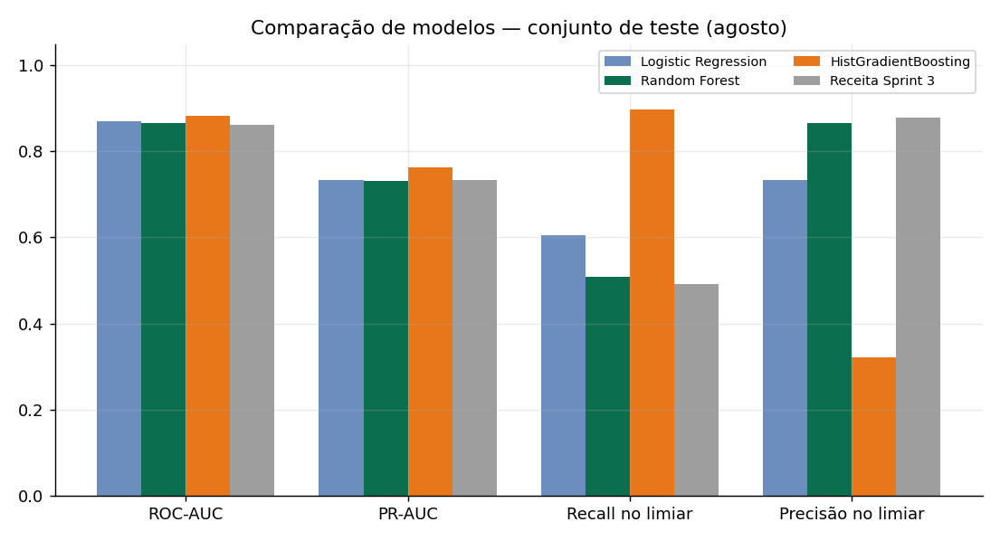
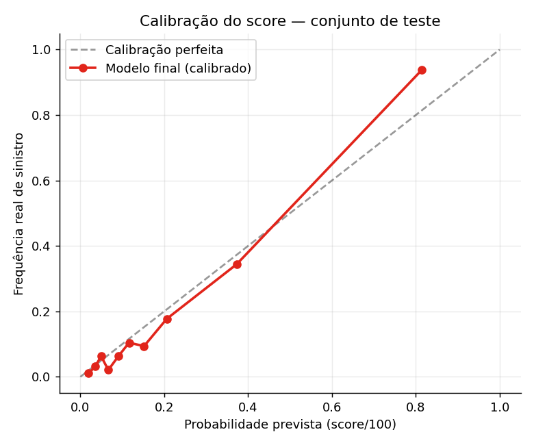
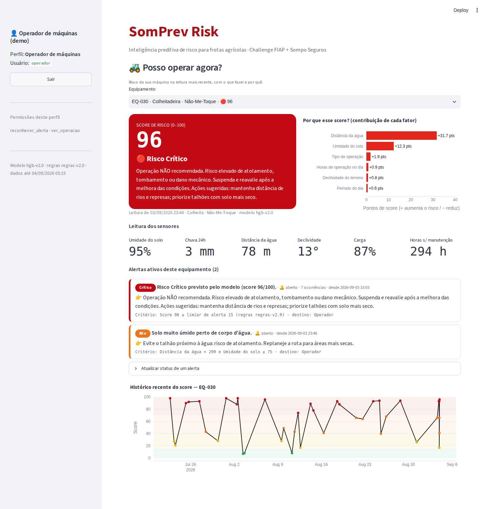
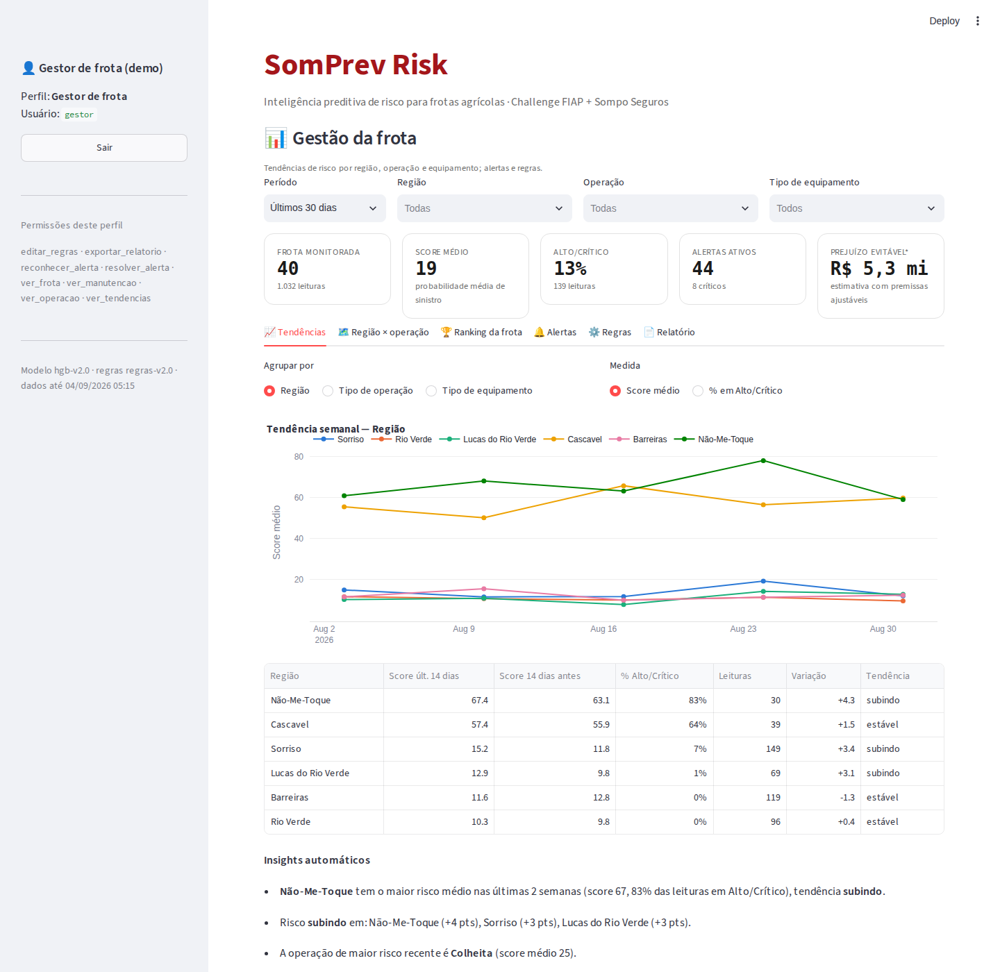
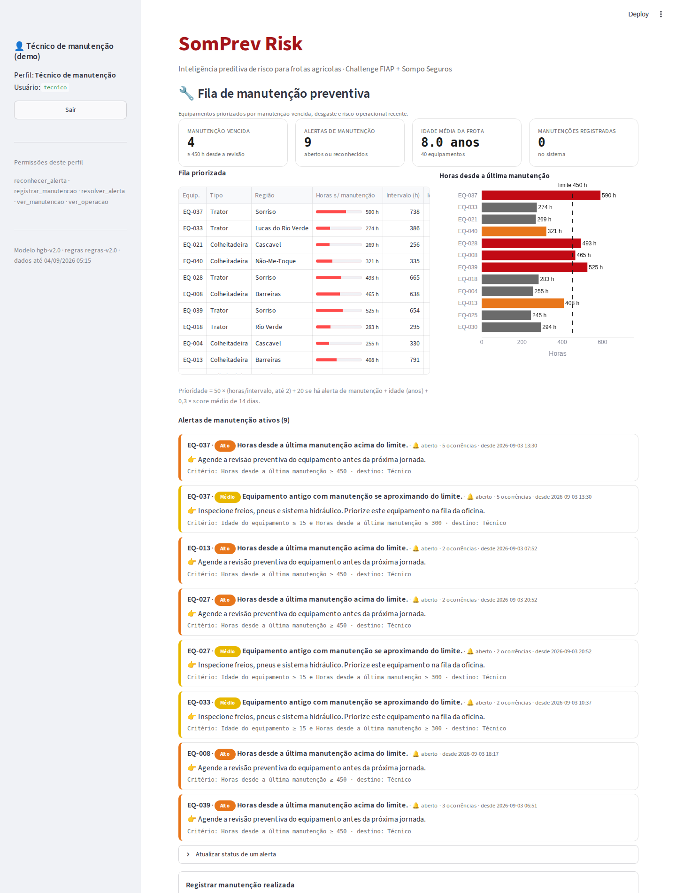
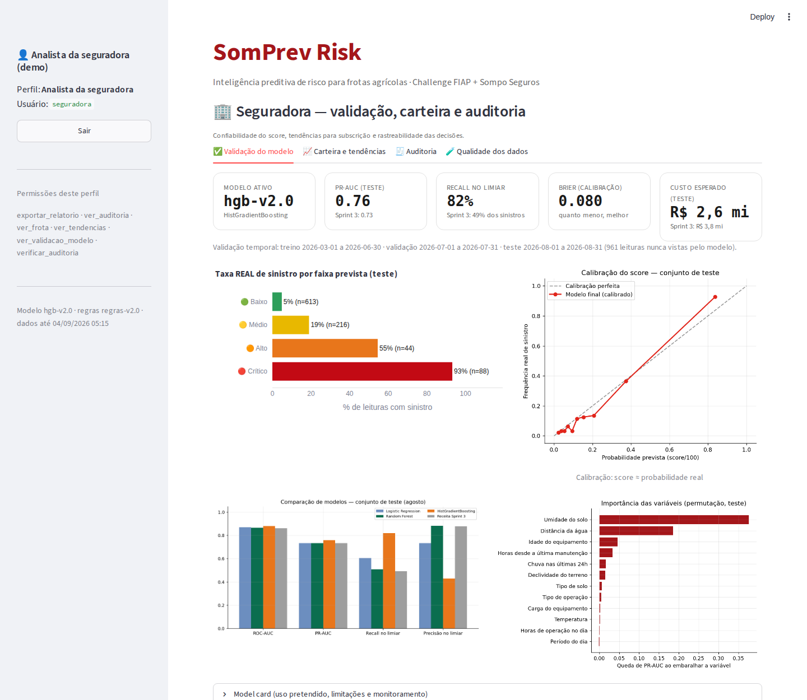
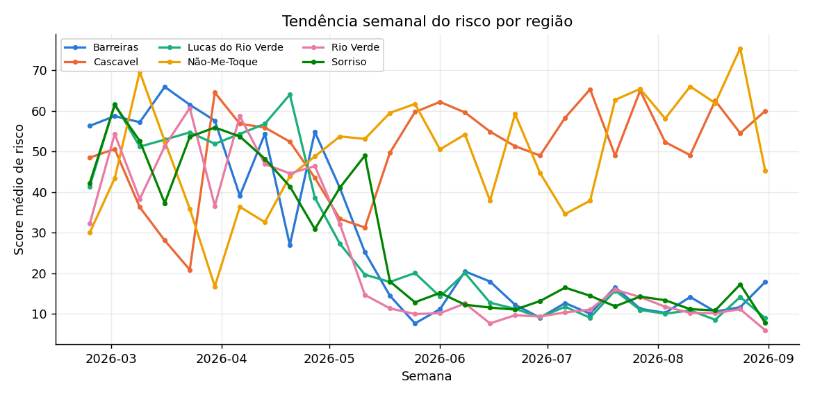
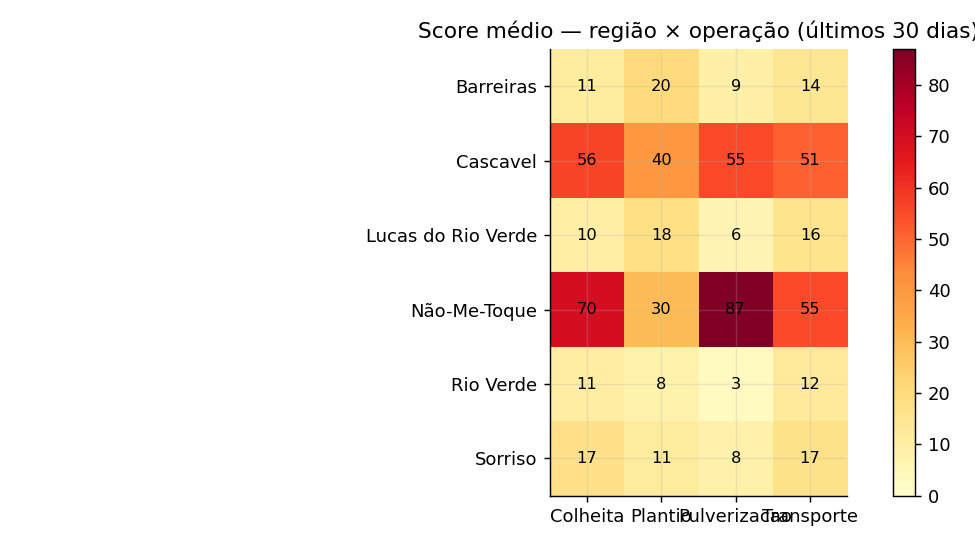

<p align="center">
  <a href="https://www.fiap.com.br/">
    
  </a>
</p>

# SomPrev Risk: Sistema Preditivo de Risco Agrícola

## Challenge FIAP + Sompo Seguros · Sprint 4 (entrega final)

O **SomPrev Risk** antecipa o risco de sinistro na operação de máquinas agrícolas (atolamento, tombamento e dano mecânico). O objetivo é que operador, técnico, gestor de frota e seguradora ajam **antes** do acidente. A cada leitura de telemetria, o sistema:

1. **valida e trata** o dado (corrige, imputa ou manda para a quarentena);
2. calcula um **score de risco de 0 a 100** (probabilidade calibrada de sinistro);
3. **explica** quais fatores levaram àquele score;
4. gera **alertas com critério explícito** e **recomendações** para cada perfil;
5. registra tudo em uma **trilha de auditoria à prova de adulteração**.

Na Sprint 4 o projeto virou um **MVP consolidado, estável e validado**: arquitetura modular, fluxo reproduzível com um comando, dados tratados, modelo final calibrado, segurança aplicada, relatórios de tendência e **113 testes automatizados**.

| Indicador (teste em agosto, dados nunca vistos pelo modelo) | Sprint 3 | **Sprint 4** |
|---|---:|---:|
| Sinistros antecipados (recall) | 49% | **82%** |
| PR-AUC | 0,73 | **0,76** |
| Custo esperado no mês (premissas em `config/regras_risco.json`) | R$ 3,8 mi | **R$ 2,6 mi** |
| Taxa real de sinistro: faixa Baixa → Crítica | não medida no teste | **5% → 93%** |
| Registros brutos aproveitados após o tratamento de qualidade | sem tratamento | **97,2%** |
| Testes automatizados | 0 | **113** |

---

## 👨‍🎓 Integrantes

- Karina Garta Szewczuk: RM569309
- Maria Sabrina Feitosa da Silva: RM568714
- Nicolas Lima Apolinário: RM570741
- Roger Gabriel de Souza Jesus Costa: RM573659

### Responsabilidades

<!-- PROPOSTA: revisar e ajustar com o grupo antes da entrega -->

| Integrante | Frente principal | Responsabilidades ao longo do Challenge |
|---|---|---|
| Karina Garta Szewczuk | Produto e negócio | Contextualização de mercado, personas e User Stories; regras de risco e premissas econômicas; validação das recomendações com a visão da seguradora |
| Maria Sabrina Feitosa da Silva | Dados, modelo e dashboard | Base de dados e modelo preditivo (Sprint 2); identidade visual e dashboards; consolidação da arquitetura, qualidade de dados e modelo v2 (Sprint 4) |
| Nicolas Lima Apolinário | Banco, testes e documentação | Estrutura do banco e consultas; testes automatizados e evidências de validação; roteiro e edição do vídeo |
| Roger Gabriel de Souza Jesus Costa | Backend, integração e segurança | Estrutura inicial do repositório; API FastAPI, persistência incremental e auditoria (Sprint 3); simulador de telemetria e controle de acesso (Sprint 4) |

## 👩‍🏫 Professores

- **Tutora:** Sabrina Otoni
- **Coordenador:** André Godói

## 🎥 Vídeos

- **Sprint 4 (MVP final):** <a href="https://youtu.be/COLOCAR_LINK" target="_blank">clique para assistir</a> *(não listado)*
- Sprint 3: <a href="https://youtu.be/Aqp8JTDbSMo" target="_blank">clique para assistir</a>

---

## ⚡ Como executar (5 minutos)

**Pré-requisito:** Python 3.10 ou superior.

```bash
# 1. dependências
pip install -r config/requirements.txt

# 2. segredos: cria o .env com chaves de API e senhas fortes e mostra as credenciais de demonstração
python run.py configurar

# 3. fluxo completo de ponta a ponta (~1 min): dados → qualidade → modelo → banco → relatórios → verificação
python run.py pipeline

# 4. em terminais separados
python run.py api           # http://127.0.0.1:8000/docs
python run.py dashboard     # http://localhost:8501  (entre com as credenciais do passo 2)

# 5. (opcional) telemetria em tempo real com falhas + reconciliação
python run.py simular

# 6. validação
python run.py verificar     # 12 verificações de integridade e consistência
python run.py testes        # 113 testes automatizados
```

> O banco versionado em `src/database/` é recriado pelo `pipeline`. As senhas ficam **somente** no seu `.env`; no banco vai apenas o hash. Para criar outro usuário: `python run.py usuario LOGIN PERFIL`.

---

## 📈 Evolução ao longo das quatro Sprints

| Sprint | Entrega | Estado do produto |
|---|---|---|
| **1** | Problema, contexto de mercado, personas e User Stories | Proposta |
| **2** | Base simulada, comparação de modelos (LR, RF, GB), banco SQLite, dashboards | Protótipo offline |
| **3** | API FastAPI, persistência incremental, API Key, login por perfil, auditoria | MVP integrado (~60%) |
| **4** | Arquitetura modular, qualidade de dados, modelo v2 calibrado, segurança, tendências, 4º perfil, testes | **MVP consolidado e validado** |

### Continuidade: o que mudou de lugar desde a Sprint 3

A Sprint 4 pede para **refinar o que já existe**, então o código da Sprint 3 foi reorganizado, não descartado: cada arquivo antigo teve a sua responsabilidade levada para um módulo com dono claro, e o histórico do git preserva tudo.

- O mapa completo **de → para**, arquivo por arquivo e com a justificativa, está em [`document/de_para_sprint3_sprint4.md`](document/de_para_sprint3_sprint4.md).
- Os dois caminhos antigos continuam funcionando como atalhos: `src/backend/app.py` ainda expõe a API e `src/dashboards/app.py` ainda sobe o dashboard.
- `src/scripts/LEIA-ME.md` diz a qual comando do `run.py` cada script antigo corresponde.

### O que a Sprint 4 trouxe, requisito por requisito

| Requisito do enunciado | Como foi atendido |
|---|---|
| **Código organizado em módulos, funções padronizadas** | Pacote `src/somprev/` com um módulo por responsabilidade; SQL centralizado no repositório; CLI única `run.py` |
| **Tratamento de exceções, fluxo estável e reproduzível** | Exceções de domínio (422/404/409/503) separadas das inesperadas (500 sem vazamento); transação atômica por leitura; `seed = 42` gera os mesmos números em qualquer máquina |
| **Inconsistências, faltantes e duplicidades** | Coleta com 514 falhas injetadas → limpeza, imputação por fonte de referência, quarentena com motivo e relatório de qualidade |
| **Ajuste final do modelo com métricas adequadas** | Validação temporal, busca de hiperparâmetros, PR-AUC, calibração, limiar por custo e comparação justa com a Sprint 3 |
| **Integração com fontes reais ou simuladas** | Simulador envia 200 leituras (15% com defeito) pela API: 200/200 respostas corretas, 0 perdas |
| **Confiabilidade da coleta e consistência** | Reconciliação `recebidas = aceitas + quarentena + duplicadas` e 12 verificações automáticas |
| **Proteção de dados e controle de acesso** | PBKDF2, bloqueio por força bruta, 4 perfis com permissões explícitas, 2 chaves de API com escopos, limite de taxa; **o próprio dashboard só lê dados através das rotas de consulta autenticadas da API** — nenhuma tela acessa o banco direto para exibir informação |
| **Logs que rastreiam entradas, saídas e decisões** | Auditoria encadeada por SHA-256 (append-only) + log JSON; `GET /leituras/{id}` mostra a rastreabilidade completa |
| **Tendências por equipamento, região e operação** | Dashboard, API `GET /relatorios/tendencias` e relatório exportável (Markdown + PNG + CSV) |
| **Alertas e recomendações com critérios explícitos** | Limiar do modelo + 5 gatilhos legíveis; cada alerta mostra o critério, o destino e o ciclo de vida |
| **README, arquitetura e evidências** | Este README, [diagrama final](document/arquitetura.png), [relatório de validação](document/relatorio_validacao.md) e [evidências](document/evidencias/) |

---

## 🏗️ Arquitetura final


### Fluxo de ponta a ponta de uma leitura

```text
coletor de campo ──JSON──▶ API FastAPI (chave de ingestão · limite de taxa · payload estrito)
                                │
                                ▼
                  QUALIDADE DE DADOS (mesma regra no lote e na API)
          duplicada? → 409 │ corrige formato │ fora da faixa → ausente │ imputa
          crítico ausente / referência inválida → QUARENTENA (422, com motivo e auditoria)
                                │
                                ▼   ┌──────────── transação atômica ────────────┐
                  MODELO v2 calibrado → probabilidade → score 0-100 → faixa     │
                  explicação: contribuição de cada variável (top 3 fatores)     │
                  REGRAS versionadas: limiar ≥ 15 + gatilhos explícitos → alertas
                  agrupamento de alertas repetidos (anti-fadiga)                │
                  grava leitura + predição + alertas + eventos de auditoria ───┘
                                │
                                ▼
          API de consulta (mesma chave de escopo) ◀── Dashboard (Operador · Técnico · Gestor · Seguradora) · Relatórios
```

### Estrutura do código

```text
run.py                         CLI única: configurar | pipeline | api | dashboard | simular | verificar | testes
config/
  regras_risco.json            regras de negócio versionadas (faixas, limiar, gatilhos, premissas)
  requirements.txt
src/somprev/
  config.py · logs.py · excecoes.py · esquema.py (contrato de dados) · regras.py · tema.py
  dados/        gerador.py (telemetria simulada v2 + falhas de coleta) · qualidade.py
  banco/        conexao.py (WAL, FK, transações) · repositorio.py (todo o SQL do sistema)
  modelo/       treino.py (seleção, calibração, limiar, métricas, model card) · inferencia.py
  seguranca/    autenticacao.py (PBKDF2, bloqueio, RBAC, chaves) · auditoria.py (cadeia de hashes)
  servicos/     processamento.py (fluxo de uma leitura) · verificacao.py · simulador.py
  relatorios/   tendencias.py
  api/app.py    backend FastAPI
  dashboard/    app.py (4 perfis, cliente da API para tudo que exibe) · cliente_api.py · componentes.py
  pipeline.py   orquestração das 7 etapas
src/backend/app.py · src/dashboards/app.py   atalhos que mantêm os caminhos da Sprint 3 funcionando
tests/          113 testes (pytest) em ambiente temporário isolado
scripts/        gerar_arquitetura.py · gerar_evidencias_seguranca.py
src/database/   schema.sql (estrutura final do banco) · queries.sql (consultas prontas) · somprev_risk.db
src/datasets/ · src/models/   dados tratados e modelo, gerados pelo pipeline (versionados)
document/       documentação, relatórios, evidências, prints e histórico das Sprints
```

---

## 🧪 Engenharia de dados

**Gerador v2** ([`dados/gerador.py`](src/somprev/dados/gerador.py)). Os dados são simulados (permitido pelo enunciado), mas agora são coerentes no tempo e no espaço:

- **cadastro fixo** de 40 máquinas (tipo, modelo e ano não mudam; na v1 a idade variava entre leituras);
- **clima compartilhado** por região e dia, com balanço hídrico do solo e **sazonalidade real**: o Cerrado seca no inverno e o Sul chove mais;
- **manutenção com memória** (as horas acumulam e zeram na revisão) e operação coerente com a máquina;
- 5.891 registros brutos de março a agosto de 2026, com **514 falhas de coleta injetadas** de propósito.

**Qualidade** ([`dados/qualidade.py`](src/somprev/dados/qualidade.py)). O contrato de dados ([`esquema.py`](src/somprev/esquema.py)) define a faixa física e se cada variável é crítica. As regras abaixo são as **mesmas** no lote e na API:

| Problema | Tratamento |
|---|---|
| Pacote reenviado / mesma máquina no mesmo instante | Mantém o primeiro; API responde 409 |
| `"55,3"`, `"Manhã"`, `" COLHEITA "` | Converte e padroniza |
| Valor fisicamente impossível (umidade 140%, carga 9.999) | Vira ausente (defeito de sensor) e segue para a imputação |
| Clima ausente | Mediana da **mesma região no mesmo dia** |
| Idade ausente ou divergente | Recalculada pelo **cadastro** (fonte mestre) |
| Uso da máquina ausente | Último valor conhecido **do equipamento** |
| Declividade, distância da água, tipo de solo ou operação ausentes | **Quarentena**: melhor não pontuar do que pontuar errado |

Resultado: **97,2% de aproveitamento**, **0 valores ausentes** após o tratamento, e toda correção fica registrada na leitura (`qualidade_status`, `qualidade_obs`). Detalhes: [`relatorio_qualidade.json`](src/datasets/relatorio_qualidade.json) e [`document/variaveis.md`](document/variaveis.md).

---

## 🧠 Modelo preditivo final

Resumo abaixo. Documento completo: [`document/modelo_preditivo.md`](document/modelo_preditivo.md).

- **Validação temporal:** treino mar–jun, validação jul, **teste ago**, que é usado uma única vez.
- **3 algoritmos** com busca de hiperparâmetros em validação cruzada temporal; escolha pelo **PR-AUC na validação** → **HistGradientBoosting** (`hgb-v2.0`).
- **Calibração** de Platt: score 70 ≈ 70% de chance real (Brier 0,080).
- **Limiar de alerta por custo:** alerta a partir de **score 15**, porque deixar passar um sinistro (R$ 85 mil × 45% evitável) custa ~10× mais que uma parada preventiva (R$ 4 mil).
- **Explicação por leitura** calculada pelo próprio modelo (efeito marginal de cada variável contra a distribuição da frota).
- **Model card** com hash SHA-256, uso pretendido, limitações e plano de monitoramento.

| Faixa | Score | Ação | Sinistro real no teste |
|---|---|---|---:|
| 🟢 Baixo | 0–14 | Operação liberada | 4,9% |
| 🟡 Médio | 15–39 | Operação com atenção | 19,0% |
| 🟠 Alto | 40–69 | Restrições e supervisão | 54,5% |
| 🔴 Crítico | 70–100 | Operação não recomendada | 93,2% |

<p align="center">
   
</p>

---

## 🔔 Alertas e recomendações

Um alerta nasce de **duas fontes**, e cada uma mostra o critério que a disparou:

| Origem | Critério (exemplo real) | Destino |
|---|---|---|
| Modelo | `Score 66 ≥ limiar de alerta 15 (regras regras-v2.0)` | Operador (Médio/Alto) ou Gestor (Crítico) |
| `AREA_ALAGAVEL` | `Distância da água < 200 e Umidade do solo ≥ 75` | Operador |
| `SOLO_SATURADO` | `Chuva nas últimas 24h ≥ 80 e Tipo de solo ∈ Argiloso/Encharcado` | Operador |
| `RISCO_TOMBAMENTO` | `Declividade do terreno ≥ 27 e Carga do equipamento ≥ 95` | Operador |
| `MANUTENCAO_VENCIDA` | `Horas desde a última manutenção ≥ 450` | Técnico |
| `DESGASTE_ACUMULADO` | `Idade do equipamento ≥ 15 e Horas desde a última manutenção ≥ 300` | Técnico |

- **Recomendação acionável:** texto da faixa + ações dos 2 principais fatores (ex.: *"priorize talhões com solo mais seco; mantenha distância de rios e represas"*).
- **Ciclo de vida:** aberto → reconhecido → resolvido, com usuário, horário e comentário.
- **Anti-fadiga:** ocorrências repetidas do mesmo alerta em até 48 h são agrupadas.
- **Regras configuráveis** ([`config/regras_risco.json`](config/regras_risco.json)): o Gestor ajusta o limiar e as premissas no dashboard, com justificativa obrigatória. Cada ajuste gera uma **nova versão**, e cada predição grava a versão que usou.

---

## 🔐 Segurança e rastreabilidade

Resumo abaixo. Documento completo, com a matriz de permissões: [`document/seguranca.md`](document/seguranca.md).

- **Acesso:** 4 perfis com permissões explícitas (privilégio mínimo); senha só como hash **PBKDF2-SHA256 (600 mil iterações)**; bloqueio após 5 erros; sessão expira em 30 min; mensagem de erro genérica.
- **API:** chave de **ingestão** ≠ chave de **consulta** (403 se trocadas); limite de taxa (429); payload estrito; erro 500 sem detalhes internos.
- **Dashboard como cliente da própria API:** todo dado exibido nas 4 visões (leituras, alertas, equipamentos, manutenções, quarentena, auditoria, verificação) vem das rotas `GET` de consulta, com a mesma chave de escopo — não há leitura direta do banco pelo painel. Só as escritas de um usuário logado (reconhecer/resolver alerta, registrar manutenção, editar regras) continuam diretas, sob o RBAC de sessão do próprio dashboard, que é uma fronteira de autorização diferente e já adequada.
- **Integridade:** `CHECK`, `FOREIGN KEY` e `UNIQUE` no banco; hash SHA-256 do payload de cada leitura e do artefato do modelo.
- **Auditoria à prova de adulteração:** cada evento carrega o hash do anterior (como um livro-razão); triggers impedem `UPDATE` e `DELETE`; a verificação aponta o evento exato em caso de adulteração. Há teste automatizado para isso.
- **Rastreabilidade de ponta a ponta:** `GET /leituras/{id}` devolve a entrada (com hash), a saída (score, faixa, contribuição de cada fator, versões do modelo e das regras), os alertas com critério e a trilha de auditoria da leitura.

---

## 🖥️ Dashboard por perfil

| Perfil | Pergunta que responde | Principais recursos |
|---|---|---|
| 🚜 **Operador** | "Posso operar agora?" | Semáforo, recomendação com ações, **por que esse score** (contribuição de cada fator), sensores, alertas do equipamento |
| 🔧 **Técnico** *(novo)* | "Qual máquina vai para a oficina primeiro?" | Fila priorizada (fórmula explícita), horas × limite, alertas de manutenção, **registro de manutenção** |
| 📊 **Gestor** | "Onde e quando o risco está subindo?" | Tendências por região, operação e tipo de máquina; matriz região × operação; ranking; alertas; **edição de regras**; exportação |
| 🏢 **Seguradora** | "Posso confiar no score e no histórico?" | Validação no teste, calibração, comparação com a Sprint 3, carteira por região, **verificação da auditoria**, qualidade dos dados |

<p align="center">
   
</p>
<p align="center">
   
</p>

Todos os prints: [`document/prints/sprint4/`](document/prints/sprint4/)

---

## ⚙️ API

Documentação interativa: `http://127.0.0.1:8000/docs`

| Método | Rota | Chave | Descrição |
|---|---|---|---|
| GET | `/health` | pública | Estado do banco, do modelo e das regras |
| POST | `/telemetria` | ingestão | Processa uma leitura: score, faixa, fatores, recomendação, alertas e recibo de auditoria |
| POST | `/telemetria/lote` | ingestão | Até 500 leituras; uma leitura ruim não interrompe as demais |
| GET | `/leituras/{id}` | consulta | Rastreabilidade completa da leitura |
| GET | `/equipamentos/{id}/risco` | consulta | Último score e alertas ativos |
| GET | `/alertas` | consulta | Filtros por status, perfil e equipamento |
| GET | `/relatorios/tendencias` | consulta | Série semanal e variação recente por dimensão |
| GET | `/modelo` | consulta | Model card da versão ativa |
| GET | `/auditoria/verificar` | consulta | Verificação criptográfica da trilha |
| GET | `/leituras` | consulta | Leituras com score, para o dashboard |
| GET | `/equipamentos` | consulta | Cadastro de equipamentos, para o dashboard |
| GET | `/manutencoes` | consulta | Histórico de manutenções, para o dashboard |
| GET | `/quarentena` | consulta | Leituras em quarentena, para o dashboard |
| GET | `/auditoria` | consulta | Eventos de auditoria (com filtro), para o dashboard |
| GET | `/verificacao` | consulta | As 12 verificações automáticas, para o dashboard |

---

## 📊 Relatórios de tendência

`python run.py pipeline` (ou `python run.py relatorio`) gera [`document/relatorios/relatorio_tendencias.md`](document/relatorios/relatorio_tendencias.md), com resumo executivo automático, tendência semanal **por região, por operação e por equipamento** (os 5 de maior risco), matriz região × operação, ranking de equipamentos e alertas em aberto, além dos CSVs para BI. No dashboard, o Gestor escolhe a dimensão (região, operação, tipo de máquina ou equipamentos específicos).

<p align="center">
   
</p>

---

## ✅ Validação do MVP

Relatório completo: [`document/relatorio_validacao.md`](document/relatorio_validacao.md)

| Evidência | Resultado | Arquivo |
|---|---|---|
| Pipeline de ponta a ponta | 7 etapas, 12/12 verificações | [`execucao_pipeline.txt`](document/evidencias/execucao_pipeline.txt) |
| Verificação de integridade | 12/12 ✔ (inclui cadeia de auditoria e hash do modelo) | [`verificacao_sistema.txt`](document/evidencias/verificacao_sistema.txt) |
| Integração com a fonte de dados | 200 envios, 200/200 respostas corretas, 0 perdas, p50 ~130 ms | [`validacao_integracao.md`](document/evidencias/validacao_integracao.md) |
| Testes automatizados | 113 aprovados (regras, qualidade, segurança, modelo, API, integração, dashboard) | [`resultado_testes.txt`](document/evidencias/resultado_testes.txt) |
| Segurança e rastreabilidade em uso | 401/403/422/429, bloqueio de login, permissão negada, trilha de uma leitura, log JSON, adulteração detectada | [`seguranca_rastreabilidade.md`](document/evidencias/seguranca_rastreabilidade.md) |
| Integração contínua | GitHub Actions em Python 3.10 e 3.12 | [`.github/workflows/testes.yml`](.github/workflows/testes.yml) |

> Durante a Sprint 4, **um teste automatizado encontrou um bug real de segurança**: quando o login falhava, o erro disparava um `ROLLBACK` que apagava o registro da tentativa, e por isso o bloqueio por força bruta nunca acontecia. O bug foi corrigido e o teste de regressão ficou na suíte.

---

## 🔗 Atendimento às User Stories

| User Story (Sprint 1) | Onde está no MVP | Evidência |
|---|---|---|
| Visualizar risco operacional | Semáforo do Operador; tendências do Gestor | [print](document/prints/sprint4/02_operador.png) |
| Receber alertas preventivos | Limiar por custo + 5 gatilhos, destino por perfil, ciclo de vida | `test_regras.py`, [print](document/prints/sprint4/07_gestor_alertas.png) |
| Entender fatores de risco | Contribuição de cada variável por leitura + importância global | `test_modelo.py` |
| Analisar histórico operacional | Tendências, ranking, `GET /leituras/{id}`, auditoria | [relatório](document/relatorios/relatorio_tendencias.md) |
| Melhorar a tomada de decisão | Ações específicas por fator; fila de manutenção | [print](document/prints/sprint4/03_tecnico.png) |
| Facilidade de uso | Uma tela por perfil, linguagem simples, cor sempre com rótulo | [prints](document/prints/sprint4/) |
| Configurar regras de risco | Aba Regras do Gestor, com versionamento e auditoria | [print](document/prints/sprint4/08_gestor_regras.png) |

---

## 📚 Documentação

| Documento | Conteúdo |
|---|---|
| [`de_para_sprint3_sprint4.md`](document/de_para_sprint3_sprint4.md) | Onde foi parar cada arquivo da Sprint 3 e por quê |
| [`decisoes_tecnicas.md`](document/decisoes_tecnicas.md) | Decisões das 4 Sprints, com justificativas e revisões |
| [`modelo_preditivo.md`](document/modelo_preditivo.md) | Modelo final, métricas, calibração, limiar e explicabilidade |
| [`seguranca.md`](document/seguranca.md) | Controle de acesso, proteção de dados, integridade e auditoria |
| [`relatorio_validacao.md`](document/relatorio_validacao.md) | Evidências de validação do MVP |
| [`variaveis.md`](document/variaveis.md) | Dicionário de variáveis e contrato de dados |
| [`personas.md`](document/personas.md) | Operador, Técnico, Gestor e Seguradora |
| [`contextualizacao.md`](document/contextualizacao.md) | Mercado de seguro rural e acidentes, com fontes |
| [`other/historico/`](document/other/historico/) | Arquiteturas e protótipo das Sprints anteriores |

## ⚠️ Limitações e próximos passos

- **Dados simulados:** antes de uso real, recalibrar com sinistros e telemetria da Sompo e revisar as premissas de custo.
- **Infraestrutura de MVP:** em produção, trocar SQLite por PostgreSQL, colocar HTTPS no gateway e mover o limite de taxa para Redis.
- **Monitoramento do modelo:** acompanhar PR-AUC, calibração e taxa por faixa todo mês (plano no model card).
- **Evoluções:** previsão do tempo como entrada (risco do dia seguinte), app móvel offline para o operador e integração com a regulação de sinistros.

---

## 🗃 Histórico de versões

- **4.0.0 · Sprint 4:** MVP consolidado: arquitetura modular, qualidade de dados, modelo v2 calibrado com limiar por custo, explicação por leitura, segurança (PBKDF2, RBAC, auditoria encadeada), perfil Técnico, tendências, simulador, dashboard consumindo a própria API de consulta e 113 testes.
- **0.5.0 · Sprint 3:** backend FastAPI, `POST /telemetria`, persistência incremental, API Key, login por perfil, auditoria.
- **0.4.0:** evolução dos dashboards e indicadores.
- **0.3.0:** IA, banco SQL e dashboards funcionais.
- **0.2.0 · Sprint 2:** modelo preditivo.
- **0.1.0 · Sprint 1:** estrutura inicial e proposta.

## 📋 Licença

 

[MODELO GIT FIAP](https://github.com/agodoi/template) por [FIAP](https://fiap.com.br) está licenciado sob [Attribution 4.0 International](http://creativecommons.org/licenses/by/4.0/?ref=chooser-v1).
