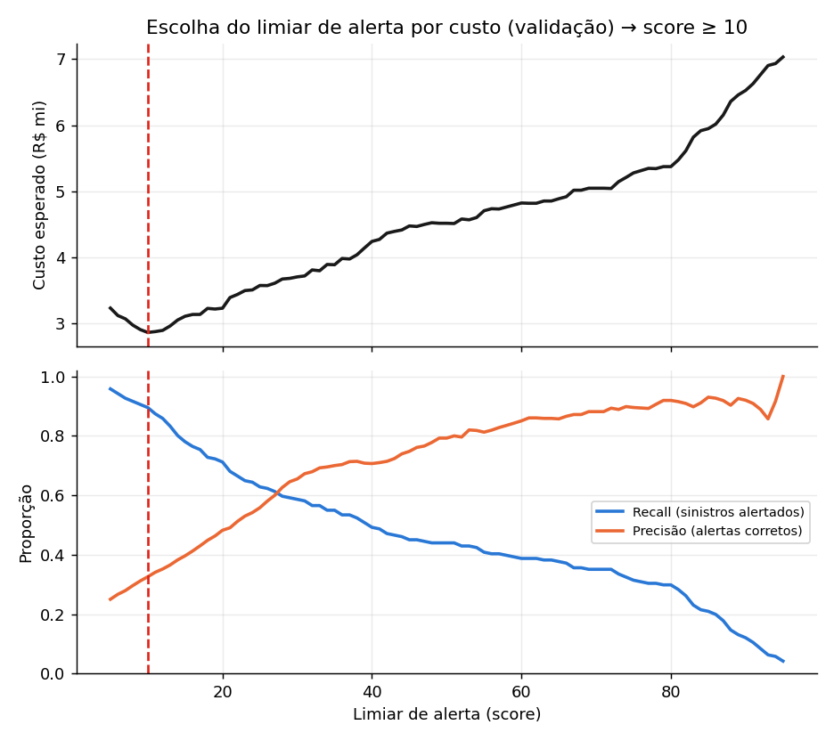
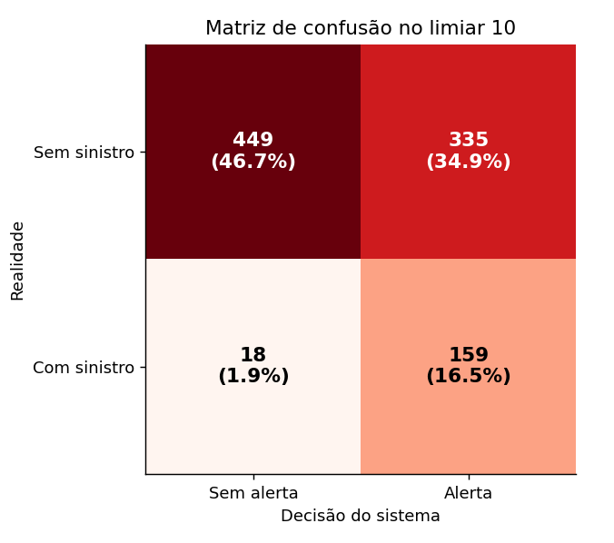
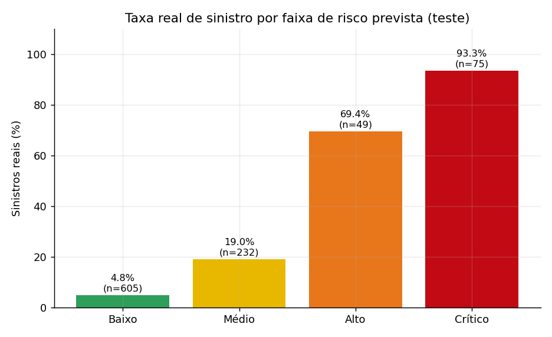
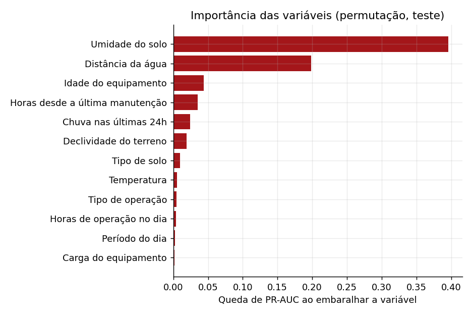

# 🧠 Modelo preditivo: versão final (Sprint 4)

Este documento explica **como o modelo final foi construído, avaliado e escolhido**, e por que cada decisão foi tomada. Todos os números vêm de [`src/models/metricas.json`](../src/models/metricas.json), gerado por `python run.py pipeline` com `seed = 42`. Qualquer pessoa que rodar o pipeline obtém os mesmos valores.

Código: [`src/somprev/modelo/treino.py`](../src/somprev/modelo/treino.py) (treino e avaliação) e [`src/somprev/modelo/inferencia.py`](../src/somprev/modelo/inferencia.py) (previsão e explicação).

---

## 1. O que mudou desde a Sprint 3 e por quê

| Tema | Sprints 2 e 3 | Sprint 4 | Por quê |
|---|---|---|---|
| Dados | Cada leitura sorteada de forma independente; a idade de uma mesma máquina variava entre leituras | Gerador v2: cadastro fixo da frota, clima compartilhado por região e dia, sazonalidade, manutenção com memória | Eliminar inconsistências e permitir **tendências** reais |
| Validação | Divisão aleatória 75/25 | **Temporal**: treino mar–jun, validação jul, teste ago | O modelo sempre prevê o futuro; a divisão aleatória infla o resultado |
| Algoritmos | 3 algoritmos com parâmetros fixos | 3 algoritmos com **busca de hiperparâmetros** em validação cruzada temporal | Escolha baseada em evidência |
| Critério de escolha | Acurácia | **PR-AUC na validação** | Classe rara (~20–37% de sinistros) e foco em antecipar sinistros |
| Probabilidade | Não calibrada | **Calibrada** (Platt) | Score 30 passa a significar ~30% de chance real |
| Limiar de alerta | 0,5 fixo | **Escolhido por custo** (score ≥ 15) | Deixar passar um sinistro custa ~10× mais que uma parada preventiva |
| Explicação | Fórmula fixa, independente do modelo | **Calculada pelo próprio modelo**, por leitura | Explicação fiel ao que o modelo realmente usou |
| Taxa real por faixa | Calculada na base inteira (incluindo o treino) | Calculada **só no teste** | Evita um resultado otimista |
| Rastreabilidade | Versão `rf-v1.0` | Versão `hgb-v2.0` + **model card** + **hash SHA-256** do artefato | Auditoria do modelo em produção |

---

## 2. Divisão temporal dos dados

| Conjunto | Período | Leituras | Taxa de sinistro |
|---|---|---:|---:|
| Treino | 01/03 a 30/06/2026 | 3.806 | 37,4% |
| Validação | 01/07 a 31/07/2026 | 933 | 20,5% |
| Teste (usado só uma vez, no final) | 01/08 a 31/08/2026 | 961 | 18,4% |

A taxa de sinistro cai do treino para o teste porque a estação seca chega ao Cerrado (MT, GO e BA). Isso é **mudança de distribuição** real, que um split aleatório esconderia. É justamente o cenário que o modelo enfrenta em produção.

---

## 3. Comparação de algoritmos

Busca aleatória de hiperparâmetros (12 combinações × 5 dobras temporais, `TimeSeriesSplit`), otimizando PR-AUC:

| Algoritmo | Melhores hiperparâmetros | PR-AUC validação | ROC-AUC teste | PR-AUC teste | Brier teste |
|---|---|---:|---:|---:|---:|
| Logistic Regression | C = 0,1 | 0,648 | 0,870 | 0,734 | 0,093 |
| Random Forest | 200 árvores, profundidade 8, folha ≥ 2 | 0,662 | 0,865 | 0,734 | 0,095 |
| **HistGradientBoosting** ✅ | 400 iterações, profundidade 3, taxa 0,03 | **0,679** | **0,881** | **0,760** | **0,083** |
| Receita da Sprint 3 (RF padrão) | 300 árvores, sem busca | — | 0,863 | 0,734 | 0,089 |

**Por que o HistGradientBoosting?**

- Teve o **maior PR-AUC na validação**, e a escolha foi feita *sem olhar o teste*.
- Captura as **interações não lineares** de risco (solo encharcado com chuva forte, declive com carga alta) melhor que o modelo linear.
- Treina em segundos e aceita regularização (profundidade 3), o que reduz o sobreajuste com poucos dados.
- A interpretabilidade que justificava o Random Forest na Sprint 2 agora vem da **explicação por leitura** (seção 6), que funciona com qualquer algoritmo.


---

## 4. Calibração: o score passa a significar probabilidade

Com `class_weight="balanced"`, o modelo ordena bem o risco, mas as probabilidades ficam infladas. A calibração de Platt (sigmoide) foi ajustada **no mês de validação**, com o modelo congelado (`FrozenEstimator`).

Resultado: o Brier score no teste caiu de 0,083 para **0,080**, e a curva de calibração acompanha a diagonal. Um score 70 corresponde a ~70% de sinistros reais.


---

## 5. Limiar de alerta escolhido por custo

Um alerta preventivo tem um custo (parada ou replanejamento: **R$ 4 mil**). Um sinistro que não foi alertado custa **R$ 85 mil × 45%** (a parcela evitável). O limiar ideal é o que **minimiza o custo total** no mês de validação:

```
custo(limiar) = nº de alertas × R$ 4.000 + nº de sinistros sem alerta × R$ 85.000 × 0,45
```

O mínimo fica em **probabilidade 0,15 (score ≥ 15)**. As premissas estão em [`config/regras_risco.json`](../config/regras_risco.json) e podem ser recalibradas com dados reais da Sompo.



### Resultado no teste (agosto, 961 leituras nunca vistas)

| Métrica | Receita Sprint 3 (limiar 0,5) | **Modelo final (limiar 0,15)** |
|---|---:|---:|
| Recall (sinistros antecipados) | 49,2% | **81,9%** |
| Precisão (alertas que viraram sinistro) | 87,9% | 42,8% |
| Leituras com alerta | 10,3% | 35,3% |
| Custo esperado no mês | R$ 3,84 mi | **R$ 2,58 mi** |
| Custo sem nenhum modelo | R$ 6,77 mi | R$ 6,77 mi |

**Troca consciente:** o sistema passa a alertar mais vezes e aceita mais "alarmes falsos", mas antecipa **4 em cada 5 sinistros**, contra 1 em cada 2 antes. Para uma solução **preventiva**, deixar passar um sinistro é o erro mais caro. Para evitar a fadiga de alerta, os alertas repetidos são **agrupados** e o nível **Médio** pede atenção, não parada.



---

## 6. Faixas de risco com significado

Com o score calibrado, as faixas foram redefinidas para ter um significado probabilístico:

| Faixa | Score | Ação | Taxa **real** de sinistro no teste |
|---|---|---|---:|
| 🟢 Baixo | 0–14 | Operação liberada | 4,9% (n = 613) |
| 🟡 Médio | 15–39 | Operação com atenção (alerta ao operador) | 19,0% (n = 216) |
| 🟠 Alto | 40–69 | Operação com restrições e supervisão | 54,5% (n = 44) |
| 🔴 Crítico | 70–100 | Operação não recomendada | 93,2% (n = 88) |

- O Baixo termina exatamente no limiar de custo.
- No Alto, cerca de metade das leituras vira sinistro.
- No Crítico, cerca de 9 em cada 10 viram.
- A taxa real **cresce de forma monotônica** entre as faixas, e um teste automatizado garante isso.



---

## 7. Explicabilidade

**Global.** Importância por permutação no teste: quanto o PR-AUC cai quando os valores de uma variável são embaralhados.

| Variável | Queda de PR-AUC |
|---|---:|
| Umidade do solo | 0,376 |
| Distância da água | 0,186 |
| Idade do equipamento | 0,046 |
| Horas desde a manutenção | 0,033 |
| Chuva 24 h | 0,016 |
| Declividade | 0,015 |



**Local (por leitura).** Para cada variável, compara-se a probabilidade da leitura com a probabilidade média quando essa variável assume valores típicos da frota (15 quantis do treino). A diferença, em pontos de score, é a contribuição da variável. É a ideia do SHAP intervencional, sem dependência extra, e é **determinística**: a explicação gravada em `predicoes.explicacao_json` pode ser recalculada e conferida a qualquer momento.

Exemplo (leitura crítica de uma colheitadeira em Cascavel, score 97):

| Fator | Contribuição |
|---|---:|
| Umidade do solo (88%) | +11,5 pts |
| Distância da água (140 m) | +9,8 pts |
| Chuva nas últimas 24 h (62 mm) | +4,8 pts |

A recomendação usa esses fatores: *"… Ações sugeridas: priorize talhões com solo mais seco; mantenha distância de rios e represas."*

---

## 8. Rastreabilidade do modelo

- `src/models/model_card.json`: versão, algoritmo, hiperparâmetros, versão do scikit-learn, **hash SHA-256** do artefato, uso pretendido, uso fora do escopo, limitações e plano de monitoramento.
- A tabela `modelo_versoes` registra a versão ativa e o hash. A verificação automática confere se o arquivo `.pkl` em uso é o mesmo que foi registrado.
- Cada predição grava `modelo_versao` **e** `regras_versao`.

## 9. Limitações (honestidade técnica)

1. Os dados são **simulados** (permitido pelo enunciado). Antes de uso real, o modelo precisa ser recalibrado com sinistros da Sompo.
2. São 6 meses de histórico, o que não cobre um ciclo climático anual completo.
3. A explicação local é uma aproximação de efeito marginal, **não uma relação causal**.
4. O custo da parada preventiva e a taxa de prevenção são premissas. Mudá-las altera o limiar ótimo, e por isso ficam configuráveis e versionadas.
