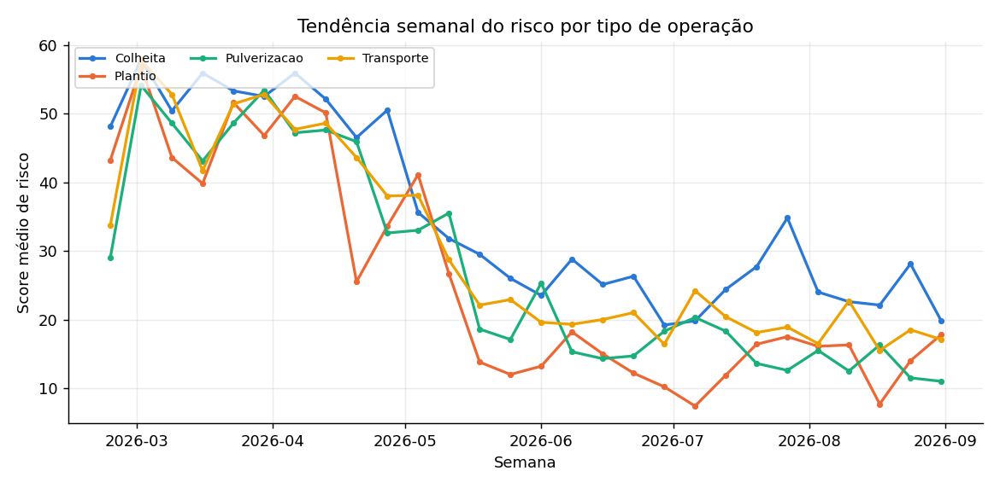
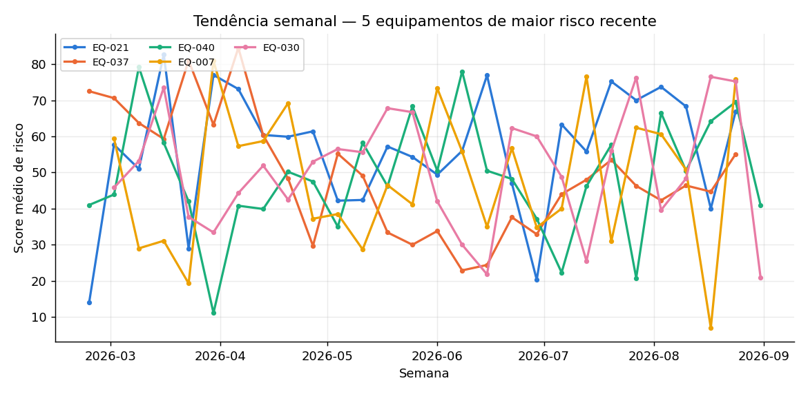
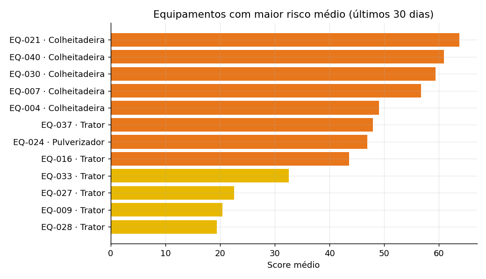

# Relatório de Tendências de Risco — SomPrev Risk

*Gerado automaticamente em 28/09/2026 23:26 · período dos dados: 01/03/2026 a 31/08/2026 · 5.723 leituras · modelo hgb-v2.0 · regras regras-v2.0*

## Resumo executivo

- **Não-Me-Toque** tem o maior risco médio nas últimas 2 semanas (score 67, 75% das leituras em Alto/Crítico), tendência **subindo**.
- Risco **subindo** em: Não-Me-Toque (+6 pts).
- A operação de maior risco recente é **Colheita** (score médio 25).
- Principal causa das leituras Alto/Crítico no último mês: **Distância da água** (50% dos casos).
- 28 alertas em aberto; 6 equipamentos aguardam manutenção preventiva.

## Tendência por região

| Região | Score (últ. 14 dias) | Score (14 dias antes) | Variação | Tendência | pct Alto/Crítico |
|---|---|---|---|---|---|
| Não-Me-Toque | 67.4 | 61.1 | +6.3 | subindo | 75% |
| Cascavel | 54.5 | 54.2 | +0.3 | estável | 61% |
| Sorriso | 13.9 | 12.2 | +1.7 | estável | 7% |
| Barreiras | 11.9 | 12.3 | -0.4 | estável | 0% |
| Lucas do Rio Verde | 11.7 | 10.2 | +1.5 | estável | 2% |
| Rio Verde | 10.6 | 10.8 | -0.2 | estável | 0% |

## Tendência por tipo de operação

| Operação | Score (últ. 14 dias) | Score (14 dias antes) | Variação | Tendência | pct Alto/Crítico |
|---|---|---|---|---|---|
| Colheita | 24.9 | 23.6 | +1.3 | estável | 20% |
| Transporte | 17.3 | 19.4 | -2.1 | estável | 7% |
| Pulverizacao | 13.0 | 14.6 | -1.5 | estável | 6% |
| Plantio | 12.5 | 15.7 | -3.2 | caindo | 5% |

## Região × operação

## Equipamentos que exigem atenção

| Equipamento | Tipo | Região | Score médio | pct Alto/Crítico | Horas desde manutenção | Tendência | Alertas abertos |
|---|---|---|---|---|---|---|---|
| EQ-021 | Colheitadeira | Cascavel | 63.8 | 70% | 76.0 | caindo | 2 |
| EQ-040 | Colheitadeira | Não-Me-Toque | 60.9 | 65% | 42.0 | estável | 1 |
| EQ-030 | Colheitadeira | Não-Me-Toque | 59.4 | 67% | 412.0 | subindo | 1 |
| EQ-007 | Colheitadeira | Cascavel | 56.7 | 62% | 107.0 | caindo | 2 |
| EQ-004 | Colheitadeira | Cascavel | 49.1 | 58% | 311.0 | estável | 0 |
| EQ-037 | Trator | Sorriso | 47.9 | 67% | 637.0 | subindo | 3 |
| EQ-024 | Pulverizador | Cascavel | 46.9 | 48% | 71.0 | caindo | 0 |
| EQ-016 | Trator | Cascavel | 43.6 | 48% | 168.0 | caindo | 1 |
| EQ-033 | Trator | Lucas do Rio Verde | 32.5 | 26% | 322.0 | subindo | 2 |
| EQ-027 | Trator | Barreiras | 22.6 | 3% | 120.0 | caindo | 1 |

## Alertas em aberto por tipo e nível

| Tipo | Médio | Alto | Crítico |
|---|---|---|---|
| CONDICAO_AMBIENTAL | 0 | 2 | 0 |
| MANUTENCAO | 2 | 5 | 0 |
| RISCO_MODELO | 13 | 2 | 4 |

---

**Como ler:** score = probabilidade calibrada de sinistro × 100. Faixas: Baixo 0–14, Médio 15–39, Alto 40–69, Crítico 70–100. Tendência compara as duas últimas semanas com as duas anteriores (±3 pontos).
